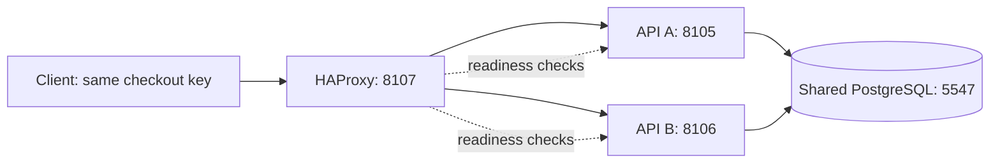

# Scenario 1: survive an API failure during checkout

Implemented and verified: 2026-10-04. Read this guide in two passes: first learn
the five interview points, then trace the files and run the experiments. Scenario
2 (provider isolation) and scenario 3 (poison-job handling) are queued separately.

## The five points to say in an interview

1. **Use one client endpoint with multiple API replicas.** HAProxy routes new
   requests to ready instances; PostgreSQL remains their shared state authority.
2. **Separate liveness, readiness and admission.** A drained process can stay
   alive, finish accepted work and reject new business requests.
3. **A missing response does not prove a failed transaction.** Checkout may have
   committed before the process died or the connection disappeared.
4. **Retry the same logical operation with the same identity.** Existing checkout
   keys and database uniqueness recover one payment intent; the proxy does not
   automatically replay writes.
5. **Test a crash and a graceful stop separately.** Graceful stop can finish work;
   crashes require recovery. One proxy and one database still limit availability.

A 60-second answer:

> I put two booking APIs behind one health-aware endpoint. During a planned stop,
> I withdraw readiness and close admission, then let accepted requests finish
> within a grace period. If the API crashes after checkout commits, the client
> cannot infer failure from the lost response. It retries the same booking, key
> and payload through the other replica, which finds the original payment intent
> in PostgreSQL. I test both that response-loss boundary and graceful draining.
> This handles an API-process failure; the single proxy and database remain
> separate availability risks.

## 1. Understand the small topology



The original direct API addresses still work. The optional overlay adds the
gateway and local controls; it reuses the existing database volume and booking
schema. No new database migration is needed for this scenario.

Think of the gateway as choosing a door. Choosing another door cannot recreate
a lost database commit or decide who owns a seat; those remain database concerns.

**Interview: three points about routing**

- A stable address hides which API serves an individual request.
- Health detection takes time; some requests can fail during that interval.
- More API replicas do not remove the shared database or proxy failure domain.

## 2. Read the implementation in order

| File | What to find |
| --- | --- |
| [compose.failover.yml](../compose.failover.yml) | Optional gateway, loopback port, opt-in controls, 20-second container stop grace |
| [haproxy.cfg](../infra/haproxy.cfg) | Round-robin, readiness probes, zero retries, Docker DNS refresh, excluded control routes |
| [application.yml](../src/main/resources/application.yml) | Graceful server shutdown, 15-second Spring grace per phase, readiness including DB |
| [AdmissionGate](../src/main/java/com/example/booking/AdmissionGate.java) | Atomic enter/drain decision and count of admitted work |
| [AdmissionFilter](../src/main/java/com/example/booking/AdmissionFilter.java) | Reject new `/api/` work while preserving health/control access |
| [FailoverController](../src/main/java/com/example/booking/FailoverController.java) | Direct-replica status, drain and resume; disabled by default |
| [BookingController](../src/main/java/com/example/booking/BookingController.java) | Validate delay before checkout, delay only after service transaction returns |
| [CheckoutResponseDelay](../src/main/java/com/example/booking/CheckoutResponseDelay.java) | Bounded post-commit delay and visible waiting-booking IDs |
| [Maintenance](../src/main/java/com/example/booking/Maintenance.java) | Enter the same gate before a new maintenance tick |
| [BookingService](../src/main/java/com/example/booking/BookingService.java) | Existing durable checkout replay; the availability work preserves this contract |
| [FailoverIntegrationTest](../src/test/java/com/example/booking/FailoverIntegrationTest.java) | Real DB and HTTP assertions for drain and post-commit response delay |
| [learn-failover.mjs](../scripts/learn-failover.mjs) | Actual process kill, graceful stop, surviving traffic and restoration |

The local reference
[HAProxy configuration](D:/AA-SYSTEM-DESIGN-ARCHITECTURE/sep-30-2026/sdir-p-main/failover_mechanisms/failover-demo/configs/haproxy.cfg)
provided the routing example. Its
[JavaScript service](D:/AA-SYSTEM-DESIGN-ARCHITECTURE/sep-30-2026/sdir-p-main/failover_mechanisms/failover-demo/src/services/server.js)
closes dependency clients and exits on SIGTERM without explicitly draining the
HTTP listener. The booking implementation uses Spring server draining and checks
the observable result. Original source was inspected, not launched.

## 3. Liveness, readiness and admission are different

| Signal | Question answered | During manual drain |
| --- | --- | --- |
| `/health` | Is this API process responding? | 200 |
| `/actuator/health/liveness` | Is the application live? | 200 |
| `/actuator/health/readiness` | Should the proxy send new work here? | 503 |
| Business `/api/` route | May this new request enter? | 503 INSTANCE_DRAINING |
| Already-admitted request | May existing work complete? | Continues |

`AdmissionGate.enter()` and `drain()` use the same Java monitor. Therefore, after
drain returns, another thread cannot increment the admitted-work count based on
an obsolete accepting flag. This is a local admission decision, distinct from
the PostgreSQL seat locks that coordinate business correctness across replicas.

The filter calls `leave()` in `finally`, even when request processing fails.
Maintenance also enters/leaves the gate. The status field `inFlight` includes
business HTTP requests and an admitted maintenance tick; it is not a count of
database transactions or payment rows. Health and control requests are excluded.

Drain publishes `REFUSING_TRAFFIC` to Spring availability. Readiness includes
`readinessState,db`, so a database dependency failure also withdraws readiness.
The local admission gate specifically covers manual drain/shutdown; it is not
a database circuit breaker or a throughput limiter.

HAProxy checks readiness every 500ms, with one failed/successful probe changing
eligibility. Request/check scheduling and connection timeouts add uncertainty;
500ms is not a guaranteed failover time. The filter covers the interval before
the proxy notices manual drain. During a crash there is no filter left to answer.

**Interview: three points about drain**

- Mark unready and close admission before stopping the process.
- Keep liveness separate so a drained instance is not mistaken for a broken one.
- Let admitted work finish; persist enough state to recover work cut off by a crash.

## 4. The most important failure boundary: commit before response

```mermaid
sequenceDiagram
  participant C as Client
  participant G as Gateway
  participant A as API A
  participant DB as PostgreSQL
  participant B as API B
  C->>G: Checkout booking X, key K, payload P
  G->>A: Forward once
  A->>DB: Persist checkout/payment intent
  DB-->>A: Commit
  Note over A: Demo response delay; then SIGKILL
  G--xC: Connection failure / error
  C->>G: Same X, K and P
  G->>B: Route to ready replica
  B->>DB: Find original checkout intent
  DB-->>B: Original payment ID/current state
  B-->>C: 200 replayed=true
```

The optional `X-Lab-Response-Delay-Ms` header creates a reproducible observation
window after `BookingService.checkout()` has returned from its transaction.
The HTTP thread waits, but it does not retain the inventory transaction or its
connection. Another request can observe the committed intent during the wait.

The allowed delay is 0–10000ms. Positive delay is rejected with 404 when controls
are disabled, and invalid bounds return 400 before checkout can mutate state.
The status endpoint exposes `waitingBookings`, letting the experiment wait for
the actual boundary instead of hoping that a timed process kill hits it.

HAProxy sets `retries 0` and `retry-on none`. Recovery is an explicit caller replay
using the booking's contract. Event creation has no idempotency key; transparently
replaying every POST would be unsafe. The `X-Booking-Instance` response header makes
routing observable without modifying the business response model.
[HAProxy configuration reference](https://docs.haproxy.org/3.2/configuration.html).

**Interview: three points about ambiguous outcomes**

- Commit and response delivery are separate events.
- Replay must preserve booking ID, key and payload, not create a new operation.
- Assert one durable payment and one checkout audit, not merely a successful retry.

## 5. Graceful shutdown versus a crash

The graceful path is: drain A, observe readiness/admission, keep B ready, then
send SIGTERM to A. Tomcat stops accepting new connections and lets in-flight work
finish within its shutdown grace. The Docker entrypoint runs Java directly, so
the process receives the stop signal. The configured container grace is 20s;
Spring's timeout is 15s **per shutdown phase**, not a universal 15-second limit
for the entire application shutdown.
[Spring shutdown behavior](https://docs.spring.io/spring-boot/3.5/reference/web/graceful-shutdown.html).

A currently admitted maintenance tick may finish; new ticks cannot enter the
closed gate. Persistent payment claims remain recoverable after lease expiry if
termination cuts one off. This scenario reuses that existing recovery design.
It does not introduce provider isolation or poison-job handling.

The crash path sends SIGKILL. It bypasses graceful hooks. In-flight responses can
disappear even after their transactions commit. Both experiments must exist:
passing the graceful test says nothing about a crash at the commit boundary.

**Interview: three points about shutdown**

- Planned stops coordinate routing, admission and a finite completion window.
- Abrupt failure skips those hooks; durable identities and leases support recovery.
- Verify returned responses and database state; process exit alone proves neither.

## 6. Run the bounded experiment

Prerequisites: Java 21, Maven, Docker and Node. The failover overlay uses ports
8105/8106/8107 and PostgreSQL 5547. Run from the project directory; preserve the
existing volume. Do not run this script and Postman simultaneously.

```powershell
Set-Location D:/java-projects/ticket-booking-lab
mvn -B -ntp verify
docker compose -f compose.yml -f compose.failover.yml config --quiet
docker compose -f compose.yml -f compose.failover.yml build api-a api-b
docker compose -f compose.yml -f compose.failover.yml up -d --wait
docker compose -f compose.yml -f compose.failover.yml exec -T gateway haproxy -c -f /usr/local/etc/haproxy/haproxy.cfg
node scripts/learn-failover.mjs
```

The script creates four fresh retained event/hold fixtures, checks both replicas,
drains both to demonstrate bounded 503, then runs:

1. **Crash:** route a delayed checkout to A, observe its committed payment, make
   B ready, kill A, observe response loss, replay through B, assert payment/audit
   cardinality and confirmation, and admit a fresh booking through B.
2. **Graceful stop:** restart A, route another delayed checkout to A, drain A,
   restore B admission, stop A with SIGTERM, admit work through B, and verify A's
   already-admitted response still returns 202 before the stop completes.

It restores A/B/gateway and resumes both replicas in `finally`. Evidence is saved
to `target/failover-runtime-evidence.json`, including restoration status. If that
status is false, use the recovery commands below and inspect logs. The script
does not delete fixtures or volumes.

```powershell
docker compose -f compose.yml -f compose.failover.yml start api-a api-b gateway
Invoke-RestMethod -Method Post http://localhost:8105/api/demo/failover/resume
Invoke-RestMethod -Method Post http://localhost:8106/api/demo/failover/resume
docker compose -f compose.yml -f compose.failover.yml ps
# Stop when finished; data remains retained.
docker compose -f compose.yml -f compose.failover.yml stop
```

If an API is still starting, wait for its direct control endpoint before resume.
A fresh process starts accepting again after startup. Manual drain state is local
and transient; no sticky gateway session or durable drain flag is assumed.

## 7. Explore it in Postman and IntelliJ

Import [the failover collection](../postman/failover.postman_collection.json) and
[failover environment](../postman/failover.postman_environment.json). Run in order.
It creates fresh data, checks shared routing and response delay, drains A, checks
its readiness/liveness and rejected business traffic, reads through B, then resumes
A. It does not kill Docker processes; the Node experiment performs those checks.

```powershell
npx --yes newman@6.2.2 run postman/failover.postman_collection.json -e postman/failover.postman_environment.json
```

If you stop the collection before its resume request, resume A using its direct
control URL. The original booking collection remains a separate regression suite.
Controls are unauthenticated local fixtures, disabled without the overlay and
excluded at the shared gateway path. Loopback publishing is not production auth.

In IntelliJ, follow a checkout through `BookingController.checkout`,
`BookingService.checkout`, and `CheckoutResponseDelay.afterCommit`. Pause briefly
at the last boundary: the transaction has completed. Inspect the same booking
through B. Then follow `AdmissionGate.drain` and the filter's `enter` decision.
Database time continues advancing while debugging; long pauses can expire holds.

Three predictions to make before running:

- Why can payment already be CONFIRMED when the delayed original body says CHECKOUT?
  The body was constructed earlier; replay/lookup returns current state.
- Why does a drained A return 200 on liveness but 503 on booking reads?
  Process survival and admission eligibility are separate decisions.
- Why does a shared-endpoint retry require no sticky session?
  The authoritative intent is shared in PostgreSQL rather than stored in API memory.

## 8. Evidence, capacity and limits

Use [VERIFICATION](VERIFICATION.md) for exact executed counts and timings. Timing
observations include polling, process commands and scheduling; they are not a
production SLO. The demo delays are injected, not actual provider latency.

For an illustrative capacity discussion, if each API safely supports C requests/s,
two normally offer up to 2C for independent work; losing one leaves C. Running
both near their limit leaves no failure headroom. Database lock/CPU capacity may
be the tighter bound. Drain admission does not provide waiting-room fairness or
a retry budget.

The single gateway, single PostgreSQL primary and single host remain failure
domains. Database outage withdraws both APIs from readiness and blocks booking;
the system does not sell from stale memory. Gateway HA, database failover,
multi-zone placement and sustained-load verification are later studies.

**Interview: three points about scope**

- State which failure was tested: one API process, not every dependency.
- Keep capacity headroom for the surviving replica and database.
- Report measured recovery and correctness separately from availability promises.

Next: review these five interview points and reproduce scenario 1. Provider
isolation and poison-job handling are authorized in that order for later separate
deliveries, each with its own detailed guide and 3–5 interview points per subtopic.
