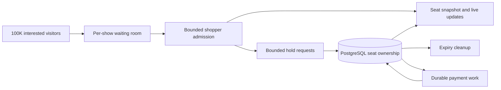
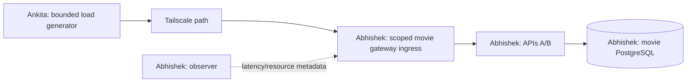

# A hot show: 100K visitors, live availability and retry storms

Planning/study only, 2026-10-05. The user explicitly said **do not implement yet**.
No waiting room, availability stream, hold admission limit or retry-storm harness
has been added. No load has been run. Study existing scenario 2 first; build the
controlled hold-retry comparison separately after the user resumes implementation.

Future experiment topology is selected: **Abhishek runs the actual services;
Ankita generates business load over Tailscale**. Tool/resource budgets and the
reachable endpoint still need to be established. See the
[simulation plan](MOVIE_LOAD_SIMULATION_PLAN.md) and [context](../PROJECT_CONTEXT.md).

## 1. Separate demand, inventory and work

For one show, most of the 100K visitors will never receive a seat. The aim is an
orderly experience, accurate ownership and continued service for existing buyers.

| Inventory | Maximum single-seat winners out of 100K | If every successful group buys exactly two seats |
| --- | --- | --- |
| 33 seats | 33 buyers, 0.033% | 16 groups, one seat left |
| 200 seats | 200 buyers, 0.2% | 100 groups |
| 500 seats | 500 buyers, 0.5% | 250 groups |

These assume no cancellation/resale. Category preferences and group size can
prevent a requested group from fitting even while some seats remain. Current
screen validation/schema support **200-500**, not 33 seats; 33 is a design example.

100K visitors arriving over 60 seconds means about 1,667 arrivals/s. That is a
different workload from 100K concurrent viewers. If every viewer polls once a
second, that is 100K requests/s. A 20-second average poll interval still produces
about 5K requests/s, before retries. A waiting-room refresh must be served outside
the booking database path; changing an interval alone does not solve overload.

Use a per-show waiting room, a measured active-shopper cap, a new-shopper rate cap
and a separate cap on in-flight booking writes. A queue place permits waiting;
admission permits shopping; only a successful inventory transaction grants seats.
Cloudflare's waiting-room design likewise distinguishes active users from the
rate of newly admitted visitors. That is a useful design reference, not a product
selection or a promise that its settings fit a small custom lab.
[Official waiting-room explanation](https://developers.cloudflare.com/waiting-room/about/).

This is the proposed architecture. The current HAProxy socket cap and lifecycle
AdmissionGate do not implement this business admission policy.

## 2. What already exists, and what does not

| Area | Source-grounded current behavior |
| --- | --- |
| Movie hold | Atomic 1-10-seat group; sorted seat locks; durable buyer/key replay |
| Seat map | GET show seats derives AVAILABLE/HELD/BOOKED from committed ownership and DB time |
| Logical expiry | Expired HELD/PAYMENT_PENDING stops blocking a new hold, even before cleanup |
| Cleanup | Bounded expiry batches; owned pointers released under locks; audit/state updated |
| Movie payment failure | Retains seats until original deadline; fresh payment key allowed after definite failure |
| Movie payment retry | One logical retry with fixed 500ms delay; durable lease/receipt identities |
| Generic provider-isolation mode | Jittered backoff, dispatch budget, breaker, bounded calls and shared checkout backlog admission |
| Lifecycle AdmissionGate | Drain/readiness coordination; no general concurrency/rate cap |
| Live seat delivery | No SSE/WebSocket availability endpoint or shared fan-out exists |
| Hold retry control | No general caller policy, waiting room or shared hold-traffic admission limit |

The generic scenario 2 guarantees do **not** apply automatically to V5 movie
payments. The movie mock is in-process and shares PostgreSQL availability. The
inherited generic outbox also does not publish movie seat transitions.

## 3. How selection and expiry should look to clients

A click on a seat is initially private browser state. Send the selected group
to POST `/api/movie/holds`. Only after commit should other viewers see HELD.
If one seat is unavailable, the entire group fails; no partial group is reserved.

| Committed condition | Public seat status | Buyer-facing action |
| --- | --- | --- |
| No valid owner | AVAILABLE | May request a hold; availability is advisory |
| Live HELD or PAYMENT_PENDING owner | HELD | Owner sees original deadline; other buyers choose elsewhere |
| Owner is CONFIRMED | BOOKED | No new hold for this seat |
| Hold deadline has passed | AVAILABLE | Another buyer may hold it, subject to show-start checks |
| Payment definitely fails before deadline | HELD | Owner may start a fresh payment; deadline stays fixed |
| Cancellation releases this owner's pointers | AVAILABLE | New requests compete normally |

Do not equate “all seats held” with permanent sold-out. Pause fresh shopping and
show that seats may return. All confirmed seats can be treated as sold-out under
the chosen cancellation/resale policy. After show start, also expose show-level
`bookable=false`; an unowned seat is not necessarily still for sale.

### Current expiry mechanism: two separate steps

**Logical validity:** [MovieCatalog.seats](../src/main/java/com/example/booking/MovieCatalog.java)
uses PostgreSQL statement time to render a live hold as HELD. Once its deadline
passes, it renders AVAILABLE. The new-hold transaction similarly tests occupancy
with database time under the selected seat locks. It can replace an expired
owner's pointer without waiting for a scheduler tick.

**Durable cleanup:** [MovieBookingService.expireBatch/get](../src/main/java/com/example/booking/MovieBookingService.java)
finds up to 20 due bookings. For each booking, it locks every historical member
seat in sorted order, then the booking, and calls
[MovieStore.expireLocked/release](../src/main/java/com/example/booking/MovieStore.java).
The state becomes EXPIRED and release clears only pointers still equal to this
booking ID. A late cleanup cannot clear a newer buyer's ownership.

The default [movie worker](../src/main/java/com/example/booking/MoviePaymentService.java)
runs expiry before payment recovery, with a configured 200ms fixed delay. That
is a scheduling setting, not a guaranteed maximum expiry lag: batch size, database
contention, work duration and exceptions matter. The manual movie overlay disables
the loops. A later implementation should isolate bounded expiry work from payment
processing so a payment incident does not delay cleanup unnecessarily.

Example: Alice holds seats 1 and 2 until 12:00:30. At 12:00:31 Bob locks those
seats, observes expiry and acquires both. Later Alice's cleanup marks her booking
EXPIRED but leaves Bob's pointers intact. Alice's late payment success records a
refund obligation; it cannot take the seats back. Existing tests/evidence cover
bounded correctness, not the proposed live transport or 100K capacity.

Never rely on a browser timer, Redis TTL or a pushed message as the authority
for releasing inventory. Timer zero means refresh/await authoritative state;
it does not prove that another buyer has not already acquired the seat.

## 4. Proposed first live-availability implementation

Recommend **server-sent events (SSE)** for one-way availability updates, retaining
HTTP for holds, checkout and cancellation. A browser needs updates from the server;
bidirectional WebSockets are not required for this contract. This is a proposal.
Spring MVC provides SseEmitter, but servlet streaming writes can block. Heartbeats,
timeouts and bounded sending resources need explicit treatment.
[Spring asynchronous request documentation](https://docs.spring.io/spring-framework/reference/web/webmvc/mvc-ann-async.html).

Proposed endpoints, currently absent:

- GET `/api/movie/shows/{id}/availability`: one complete, internally consistent
  snapshot with DB observation time, bookability, counts and all numbered seats.
- GET `/api/movie/shows/{id}/availability/stream`: initial complete snapshot,
  replacement snapshots on change, plus periodic freshness/heartbeat information.

For the first bounded lab delivery, refresh once per **subscribed show per API
replica**, then share that snapshot with its local subscribers. Use a single
read statement to derive seats, counts and observation time consistently, with
no inventory locks. Avoid one database read per viewer. A proposed 500ms refresh
interval on two APIs is roughly four snapshot refreshes/s for one show, independent
of viewer count; actual SQL statement count depends on implementation. Multiple
active shows multiply the work, so cap active-show subscriptions as well.

This periodic approach observes commits from either replica and naturally notices
time-based expiry without needing an emitted transition. It can coalesce brief
transitions between reads; its contract is current availability, not an audit
stream. A proposed freshness target of one second under bounded healthy load
must be measured before it becomes a delivery claim.

The initial snapshot and later snapshots must use one serialized subscription
path so an older initial map cannot overwrite a newer update. Carry a connection
identity and increasing connection-local sequence; the client replaces its whole
map and ignores older sequences on that connection. These are not global show
versions. On reconnect, including to the other replica, always resynchronize with
a complete snapshot. Do not promise durable replay from Last-Event-ID in this
first design. Changes in public availability should not expose buyer IDs,
booking/payment IDs, keys or private payment state.

Bound subscribers per show/per API, sender threads, queued sends and snapshot
memory. Coalesce to the newest pending map. A stalled socket must time out and
disconnect without blocking the refresh loop or other viewers. Bound cold-start
snapshot work too; 100K simultaneous subscriptions cannot all hit SQL. Heartbeats
detect dead clients and keep idle streams active, but configure their interval
below proxy idle timeouts and test the actual gateway. Current HAProxy has a
15-second server timeout and maxconn256: long-lived streams could consume capacity
needed by holds. Plan stream budgets/routing before opening many connections.

On a database error, label retained data stale and stop claiming it is fresh.
After recovery, send a full snapshot. Treat 409 SEAT_UNAVAILABLE as a normal result
of competing buyers, even when a recent map showed green. Delivery never grants
ownership. No 100K direct SSE capacity is implied by this small-lab design.

### Later option: a durable movie transition feed

If measurements justify it, add movie inventory changes to a transactional
outbox, with restart-safe delivery and snapshot resynchronization. Define version
scope, ordering, duplicate handling and retention before implementing deltas.
Sequence allocation alone is not commit order; adding a shared show-version lock
also creates a hot serialization point and needs a consistent lock hierarchy.
Expiry still needs database-clock handling: time passing emits no event by itself.
A lost Pub/Sub notification must not leave clients permanently stale. The existing
generic outbox is a learning reference, not an existing movie availability feed.

## 5. Study scenario 2 protections first

Read the [provider-isolation tutorial](PROVIDER_ISOLATION_TUTORIAL.md), especially
sections 1-5, then its source/tests. In the optional **generic remote-provider mode**:

- Exponential windows with jitter: first deferral 100-500ms, second 100-1000ms,
  later 100-2000ms; scheduling adds delay.
- Durable automatic dispatch stops after four claimed dispatches or a ten-second
  window from the first claim. Local breaker/slot rejections count against this
  dispatch budget. Stopping retries preserves UNKNOWN/reconciliation liability.
- Local circuit breaker allows bounded half-open probing; one probe per API,
  not one globally across all replicas.
- Two concurrent HTTP calls per API, 400ms request deadline and a separate two-slot
  processing cap in the provider stub; timeout does not prove remote work stopped.
- Shared checkout admission pauses at 100 unresolved payments or 30s oldest age.
  Existing checkout keys replay before new-intent admission is considered.

These were implemented and verified in the inherited scenario. Original tutorial
addresses/evidence describe the source lab; this standalone copy uses provider8133
when that optional mode is selected. Do not enable/reconfigure it for this study.

The general generic POST `/api/holds` experiment is unbuilt. Movie POST
`/api/movie/holds` has the same missing general traffic controls. Both have durable
replay and short database deadlines; repeated requests still consume resources.

## 6. Retry storms include holds, polling and stream reconnects

Replay protects the number of reservations, not CPU, network, connections or lock
waits. The current movie replay path still takes the buyer/key advisory lock,
locks the booking's seats and may materialize expiry. GET movie booking likewise
locks seats; 100K viewers must not use it as a public availability poll.

At 1,667 new logical operations/s, a policy allowing three retries permits up
to four transmissions per operation, or about 6,668 transmissions/s in a sustained
all-retry case. Multiple retrying layers multiply attempts further. Most visitors
should remain outside the write path in the waiting room. Backoff spaces attempts;
an attempt budget and admission cap limit how much work eventually enters.

| Result or event | Proposed client action |
| --- | --- |
| Seat/group unavailable409 | Stop this attempt; update map and let buyer choose. Do not auto-retry the same occupied group |
| Key/payload conflict409 or invalid400 | Stop and fix input; no automatic retry |
| Transport timeout/response loss | Bounded discovery using exactly the same key and immutable payload |
| Busy503 or future admission429 | Honor server delay when present; bounded jittered retry, same identity |
| Expired/cancelled replay | Show terminal state; no silent new key or extended hold |
| SSE disconnect | One reconnect owner with jitter and a budget; resync a full snapshot |
| A seat becomes AVAILABLE | Update display; no automatic hold attempt by every viewer |
| Definite payment FAILED | Buyer may deliberately start a fresh key while original hold remains valid |

Proposed initial comparison policy, **not existing behavior**: at most four total
hold transmissions including the first, a ten-second end-to-end deadline, only
one in flight per logical hold, and randomized exponential windows capped at
two seconds. Stop if a known hold deadline/show start arrives sooner. A Retry-After
floor must not be violated; add jitter after that floor and stop if it exceeds the
remaining deadline. Do not sleep while holding server locks/connections. Exhaustion
after an ambiguous response is “still unresolved,” not proof that no hold exists;
allow a separate bounded reconciliation path with the original identity.

Transient retry should be idempotent and bounded; excessive retries add contention
and bandwidth consumption. [AWS retry-backoff guidance](https://docs.aws.amazon.com/prescriptive-guidance/latest/cloud-design-patterns/retry-backoff.html).
The exact experiment values above are our proposed lab choices.

Keep proxy retries disabled and avoid independent browser, SDK and server retry
loops. Use randomized reconnects after an API restart; identical SSE retry delays
alone do not disperse the fleet. Bound fallback polling rather than starting an
aggressive poll loop for every disconnected viewer. Preserve only one stream per
viewer/show where practical, without trusting that as a server-side protection.

### Server controls must accompany client backoff

Add separate budgets for new holds, replay/discovery, availability reads/streams,
and existing payment/expiry work. A replay can receive a small reserved budget
without becoming an unlimited bypass. New-hold rejection should occur before a
database connection or seat lock is acquired. Legitimate discovery must still
find existing holds when a shopper-admission proof has expired.

A token bucket caps rate, an in-flight semaphore caps concurrency, a waiting room
controls shopping admission and PostgreSQL controls seat ownership. Two local
limits of N on two APIs allow up to 2N; a claimed shared cap needs an actual shared
atomic mechanism. Redis is a possible future coordinator, not a current dependency.
On loss of admission authority, pause fresh allocations while allowing bounded
reconciliation of existing bookings against PostgreSQL.

Budget active shoppers using measured duration: 50 active shoppers averaging
20 seconds permit roughly 2.5 new shoppers/s in steady state. If duration becomes
100 seconds, sustainable replacement is roughly 0.5/s. These are illustrative
Little's-law calculations, not recommended production thresholds. Tune caps from
measured lock waits, pool pressure, payment backlog and expiry lag. Increasing API
replicas or pool sizes does not remove contention on the same scarce seat rows.

For fairness, define FIFO entry or a documented pre-sale lottery, then preserve
queue identity across refreshes. PostgreSQL lock acquisition is not a buyer
fairness policy. A future show/buyer-bound admission proof must be checked on write
routes, including any reachable direct API route. Tailscale access does not supply
per-buyer purchase identity; the current buyer labels are unauthenticated fixtures.

## 7. Future experiment: Abhishek services, Ankita load over Tailscale

Record actual peer addresses/names later; none is invented here. Current published
movie ports bind to loopback, so an Ankita client cannot simply use Abhishek's
tailnet address on8132. A later scoped private ingress/Serve mapping is needed;
it is not configured by this document. Keep PostgreSQL, direct replica fault
controls and provider controls out of that client path. Preserve existing stacks.

Measure the path before interpreting application results. Tailscale can use
direct, DERP-relayed or peer-relayed connectivity; path changes affect latency
and throughput. Record `tailscale status` and `tailscale ping` observations for
each experiment. [Official connection-types reference](https://tailscale.com/kb/1257/connection-types).
No Tailscale configuration was inspected or changed this session.

Ankita owns business traffic; Abhishek's observer records metadata without adding
business requests. Record Ankita CPU/network saturation as well as Abhishek's
resources. End-to-end latency measured on Ankita includes the network path and
differs from gateway/backend timing. No request/response body capture is needed.

### Controlled comparison, separately selected for implementation

1. Review scenario 2 and identify retry owner, persisted identity, dispatch budget,
   backlog cap and dependency slots. Do not copy its payment budget blindly to holds.
2. First compare generic `/api/holds`: immediate bounded retries versus bounded
   jittered retries. Both arms have the same initial arrival schedule, maximum
   transmissions, overall deadline, immutable keys and finite safety limits.
   Use separate retained fixtures with the same inventory/layout; do not reuse keys
   across arms and turn the second run into a replay-only workload.
3. Introduce transient busy/response-loss faults through explicitly gated controls
   or a scoped test ingress. A seat conflict is not a transient fault. After bounded
   quiescence, discover ambiguous holds by original key and audit ownership.
4. Keep client-backoff comparison separate from a server-admission comparison;
   otherwise the experiment changes two variables at once. Use seeded random
   schedules, repeat bounded runs and report variation.
5. Then apply lessons to movie groups, per-show availability delivery, expiry and
   reconnect storms. Start at50/200 users, increase after evidence is acceptable.
   A 100K waiting-room arrival test is a later workload, not100K concurrent SQL writes.

Count logical operations, all HTTP transmissions including replays, outcomes and
retry amplification separately. Report per-second route rates, p50/p95/p99 on
Ankita, conflicts, admission rejections, timeouts, unresolved identities, DB pool
wait/lock wait, payment count/age, expiry lag and CPU/memory on both machines.
Track stream count, snapshot refresh rate/age, coalesced/dropped sends, reconnect
rate and slow-client closures. Fast409s must not hide latency of successful writes.

Quiesce clients and bounded workers before a consistent SQL audit: no overlapping
valid owners, complete confirmed groups, owner-checked release, original deadlines,
unique key outcomes and safe late-payment refunds. Waiting-room order, stale-map
correction and absence of oversell need separate evidence. Automatic stop conditions
must include generator saturation, persistent errors, resource limits and excessive
lock/expiry/backlog pressure. Select numerical limits before a run, not after it.

## 8. Delivery sequence and acceptance checks

These are proposed phases; this document authorizes no execution.

| Phase | Deliverable when subsequently selected | Evidence needed |
| --- | --- | --- |
| Study | Existing scenario2 walkthrough | Learner can distinguish dependency retry from caller hold retry |
| Retry comparison | Finite Ankita-driven generic-hold harness | Same-key response-loss discovery; amplification and resources compared |
| Live availability | Complete snapshot + bounded SSE; independent expiry cleanup | A hold on A appears on B; expiry/cancel return seats; confirmed stay booked |
| Admission | Show-specific shopper/rate/write controls | Queue refresh avoids SQL; overload caps hold; discovery remains bounded |
| Scale study | Multi-show/hot-show and reconnect workloads | Freshness/resource budgets met at measured levels; no100K claim without evidence |

Availability tests must include expiry with workers paused, cleanup after seat
reassignment, simultaneous payment/expiry, failed payment retaining its hold,
reconnect to another API, stale database snapshots, slow viewers and gateway idle
timeouts. Roll out snapshot-only reads first, then small capped stream audiences;
keep hold semantics and original deadlines unchanged. Turning off the stream must
leave existing seat-map reads and booking correctness usable.

## Read the current implementation in this order

1. [MovieCatalog.seats](../src/main/java/com/example/booking/MovieCatalog.java): DB-time public availability.
2. [MovieBookingService.hold/get/expireBatch](../src/main/java/com/example/booking/MovieBookingService.java): locks, replay cost and logical expiry.
3. [MovieStore](../src/main/java/com/example/booking/MovieStore.java): owner-checked release and durable expiry.
4. [MoviePaymentService](../src/main/java/com/example/booking/MoviePaymentService.java): cleanup scheduling, fixed retry and late success.
5. [Scenario2 tutorial](PROVIDER_ISOLATION_TUTORIAL.md): generic dependency protections.
6. [AdmissionGate](../src/main/java/com/example/booking/AdmissionGate.java), [transaction limits](../src/main/java/com/example/booking/BookingStore.java) and [gateway](../infra/haproxy.cfg): current operational boundaries.

Local learning inputs previously consulted: archived rate-limiting, retry-storm
and hot-key articles in the canonical roadmap archive, plus its original Python
token-bucket example. They explain design ideas, not current Java mechanisms.
Primary web references above support framework/network patterns; numerical budgets
and future endpoint contracts here are explicitly proposed lab choices.

## Five interview points and a short exercise

1. Queue interested visitors before scarce write capacity; inventory size is not
   the number of concurrent writes the database should admit.
2. Publish committed availability; an updated map or admission token never reserves a seat.
3. Expiry is a database-time validity rule plus owner-checked cleanup; stale workers cannot release a new buyer's seats.
4. Idempotency preserves business identity; retry budgets, jitter and admission preserve capacity.
5. Share show reads across viewers and bound streams/reconnects; distinguish network timing from backend timing.

Predict these outcomes: Alice's hold expires and Bob gets the group before cleanup;
Alice's delayed payment then succeeds. Bob keeps his seats, Alice's payment requires
refund reconciliation, and Alice's stale browser never overrides the database.
If10K viewers see a seat return, should they all auto-submit a hold? No: update
their displays and let bounded admission and explicit buyer actions govern writes.
