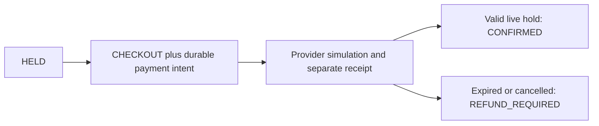

# Study ticket inventory and payment recovery in IntelliJ

Updated: 2026-10-03. This tutorial explains the code currently in this project.
Runtime exercises below are instructions and predictions, not results from this
documentation session. Existing execution evidence remains in the linked project
documents. Reading or passing a test does not establish learner mastery.

> **Running this in this repository (note added 2026-10-08).** This tutorial was
> written and verified in the original `D:/java-projects/ticket-booking-lab`. Its
> commands and diagrams keep that lab's addresses as history. In this standalone
> repository, run from `D:/sd-book-my-show` (Compose project `sd-book-my-show`) and
> substitute: API A 8105→**8130**, API B 8106→**8131**, gateway 8107→**8132**,
> provider 8123→**8133** (container port 8121 unchanged), PostgreSQL 5547→**5553**.
> The full mapping is in [standalone setup](STANDALONE_SETUP.md#separate-local-addresses).
> `git diff 6c2e57a..main` shows the generic code it uses is unchanged; later
> commits added only movie code and resource limits.
> Recommended order: see the [study path](PROJECT_STATUS.md#study-path).
> Open `D:/sd-book-my-show/pom.xml` in IntelliJ, not the original workspace `pom.xml`.

## 1. Prepare the study session

Open `D:/java-projects/pom.xml` as a Maven project, use JDK 21 for both the project
SDK and Maven runner, and reload Maven. The workspace aggregates independent
projects; it does not supply their inherited dependency configuration. On a fresh
clone, initialize the coordinator and monitor submodules before importing.

Focus on `ticket-booking-lab`. First read [System specification](SYSTEM_SPEC.md); [Run guide](USER_GUIDE.md); [API reference](API_REFERENCE.md); [Executed verification](VERIFICATION.md); [Source relationship](../PARITY.md); [Interview guide](INTERVIEW_GUIDE.md).
Use the project's README for its exact infrastructure and startup commands.
Start only the selected lab when attempting live exercises. Import its supplied
Postman collection/environment where available; dependent requests need their
preceding fixture-creation steps. This tutorial does not require running all stacks.

In IntelliJ, use Navigate to Declaration, Find Usages, the Structure view, and the
test gutter. Inspect the call stack and variables at the boundaries below.
A breakpoint in the Spring main method explains startup; the interesting
correctness decisions happen in the request, persistence, or event paths.

## 2. Read these files in order

| File | What to find and explain |
| --- | --- |
| [Models.java](../src/main/java/com/example/booking/Models.java) | Read hold/checkout input and separate booking/payment state records. |
| [BookingController.java](../src/main/java/com/example/booking/BookingController.java) | Follow hold 201/200, checkout 202/200, audit and local reconciliation APIs. |
| [BookingService.java](../src/main/java/com/example/booking/BookingService.java) | Find buyer/key serialization, seat-first locks, expiry and payment-intent admission. |
| [BookingStore.java](../src/main/java/com/example/booking/BookingStore.java) | Inspect locked(), lockSeat(), transaction timeout and DB clock. |
| [V1__booking.sql](../src/main/resources/db/migration/V1__booking.sql) | Read active-seat unique index, durable keys and payment/receipt constraints. |
| [PaymentProcessor.java](../src/main/java/com/example/booking/PaymentProcessor.java) | Follow token-checked recovery, callbacks and conditional confirmation. |
| [LocalProvider.java](../src/main/java/com/example/booking/LocalProvider.java) | Find provider receipt commit outside the inventory transaction. |
| [Maintenance.java](../src/main/java/com/example/booking/Maintenance.java) | Separate bounded expiry/recovery scans from request correctness. |

## 3. Reserve one seat and retry the hold

APIs 8105/8106 share PostgreSQL 5547. Create a new event for this study; fixtures
and receipts remain retained. All payment outcomes are local simulations.

```powershell
$studyEvent = Invoke-RestMethod -Method Post -Uri 'http://localhost:8105/api/demo/events' -ContentType 'application/json' -Body '{"name":"Study one seat","seatCount":1}'
$studyHeaders = @{ 'Idempotency-Key'=('study-hold-'+[guid]::NewGuid().ToString('N')) }
$studyBody = @{ eventId=$studyEvent.id; seatNumber=1; buyerId='study-buyer'; ttlSeconds=120 } | ConvertTo-Json
$studyBooking = Invoke-RestMethod -Method Post -Uri 'http://localhost:8105/api/holds' -Headers $studyHeaders -ContentType 'application/json' -Body $studyBody
Invoke-RestMethod -Method Post -Uri 'http://localhost:8106/api/holds' -Headers $studyHeaders -ContentType 'application/json' -Body $studyBody
```

Expected 201 HELD, then 200 `replayed:true` with the original booking/expiry.
Use a fresh key for an independent reservation. The buyer selector is a fixture,
not authenticated customer ownership.

Trace the transaction: validate request/key -> acquire buyer/key advisory lock
-> look up durable replay -> otherwise lock seat -> lock existing active booking
-> conditionally expire an old hold -> insert new hold/audit -> commit.
The advisory lock coordinates identical logical requests; the seat lock
coordinates different buyers contesting inventory. The SQL unique indexes remain
a durable backstop.

## 4. Separate an inventory decision from a payment result



Checkout persists one intent for a booking and returns 202 for new admission.
Provider work does not run inside a long seat-lock transaction. A receipt can be
committed while the API fails before recording confirmation. Recovery reads that
receipt instead of guessing from an HTTP timeout.

For a normal checkout before expiry:

```powershell
$studyCheckoutHeaders = @{ 'Idempotency-Key'=('study-checkout-'+[guid]::NewGuid().ToString('N')) }
Invoke-RestMethod -Method Post -Uri ('http://localhost:8105/api/bookings/'+$studyBooking.id+'/checkout') -Headers $studyCheckoutHeaders -ContentType 'application/json' -Body '{"scenario":"SUCCESS","delayMs":100}'
Invoke-RestMethod ('http://localhost:8106/api/bookings/'+$studyBooking.id)
```

Allow bounded recovery time before expecting CONFIRMED. A 202 means accepted work,
not proof the simulated provider succeeded. Exact checkout retry requires both
its key and scenario/delay to match. Only one payment intent exists per booking.

## 5. Debug lock order and expiry safely

Break at BookingService.hold(), BookingStore.lockSeat(), checkout's conditional
UPDATE and PaymentProcessor's result application. Inspect expiry, booking state,
payment state and reconciliation independently. Use short thread-only pauses;
DB time keeps advancing while IntelliJ is stopped.

All inventory mutations use seat-before-booking order, including maintenance
and callbacks. Explain the deadlock risk if another path locks booking then seat.
The partial unique index excludes terminal bookings, but expiry must actually
transition state before the expired row ceases to occupy that uniqueness scope.

| Experiment using a fresh fixture/test | Expected boundary |
| --- | --- |
| Two buyers concurrently request one seat | One active winner; other conflicts |
| Same buyer/key across replicas | One durable booking |
| Same key changed seat/TTL |409 |
| Retry an expired original hold | Same expired booking; no new hold |
| Provider success arrives after expiry and reassignment | Refund reconciliation; no seat theft |
| Duplicate provider callback | No repeated inventory transition |
| UNKNOWN receipt outcome | Recovery reconciles durable evidence |

Use isolated tests for expiry and races. Do not infer correctness from the
maintenance poll interval: the final mutation rechecks DB time after waiting for
locks. Pausing checkout until it expires can legitimately change the outcome.

## 6. Senior, staff and principal exercises

The authoritative unit is one numbered seat, not a cached available-seat counter.
Illustrative 1000 buyers/s all competing for one seat still serialize on one lock;
adding replicas increases contention rather than inventory. Distributing separate
events/seats can increase parallelism. For multi-seat bookings, deterministic
lock order and all-or-nothing hold rules would need a new design.

Define proposed SLOs separately for hold response, checkout admission, eventual
payment resolution and refund backlog. Watch lock wait, conflicts, expired holds,
UNKNOWN age and refund-required count. Inventory and provider teams need clear
ownership for ambiguous outcomes.

At staff depth, compare PostgreSQL locks with optimistic versions and Redis holds:
a separate cache needs a protocol that preserves final inventory authority.
At principal depth, explain event partitioning, fairness/waiting-room admission,
durability/failover and migration. A seat authority cannot safely be dual-written
without an ownership cutover.

Exercises: draw commit-before-response-loss; explain why retry keys are durable;
show a late-success timeline after another buyer wins; describe refund-required
versus refunded-simulated. No real payment or external exactly-once claim follows
from the local provider tests.

## Read the tests as executable design notes

Open [BookingIntegrationTest.java](../src/test/java/com/example/booking/BookingIntegrationTest.java) and start with:

- `manyBuyersCannotOversellOneSeat`.
- `concurrentDuplicateHoldReturnsOneDurableBooking`.
- `expiredReplayNeverCreatesAnotherHold`.
- `unknownOutcomeRecoversFromDurableReceipt`.

For each test, identify its initial state, competing or failing action, asserted invariant, and enforcing code. Check whether it uses mocks, controlled time, real infrastructure, or multiple running JVMs; these establish different levels of evidence. Run individual deterministic tests from the test gutter before attempting a live failure exercise.

## Run a separate host process under the debugger

Keep only this lab's documented infrastructure running. In IntelliJ, run
[BookingApplication.java](../src/main/java/com/example/booking/BookingApplication.java) using this project's module classpath and set these run-configuration
environment variables:

```text
PORT=18105;INSTANCE_ID=IDEA;MAINTENANCE_ENABLED=false
```

Read [application.yml](../src/main/resources/application.yml) and confirm that its
localhost database/Redis ports match the selected stack. Use a free host port;
the suggested port does not imply it has been reserved. Send the tutorial's
requests to this host port to reach IntelliJ rather than Docker A/B. Select Debug,
set the listed breakpoints, and inspect the call stack before stepping into the
persistence/client boundary. Docker maintenance continues; the host API can trace hold/checkout and inspect persisted results.

Do not pause all threads while holding live transactions or leases. Prefer
Suspend:Thread and short pauses; use controlled-clock unit tests for longer
inspection. An additional host process adds connections or namespace participants,
so its observations are separate from the previously recorded two-replica checks.
No interactive IntelliJ run is claimed by this documentation session.

## Study record

Write a short trace in your own words: input identity, admission, authoritative state, atomic boundary, reply, and retry after a lost reply. Record predictions separately from observations. Explain one limitation and the evidence you would need to remove it. Retain your fixtures; do not run Maven clean, file deletion, data resets, or global Docker cleanup. Any live fault experiment should follow the project run guide and restore only its selected services.
