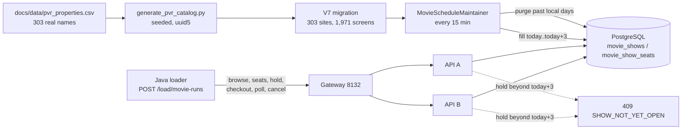
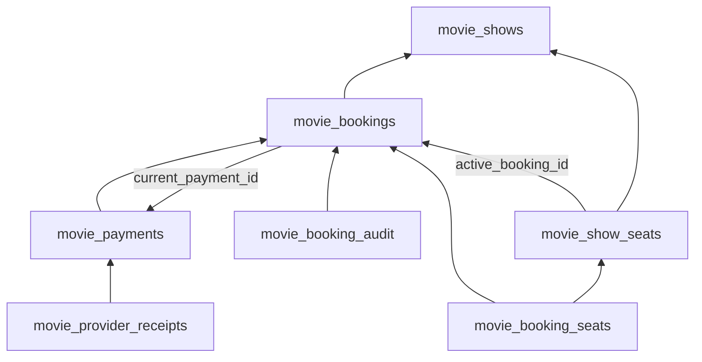
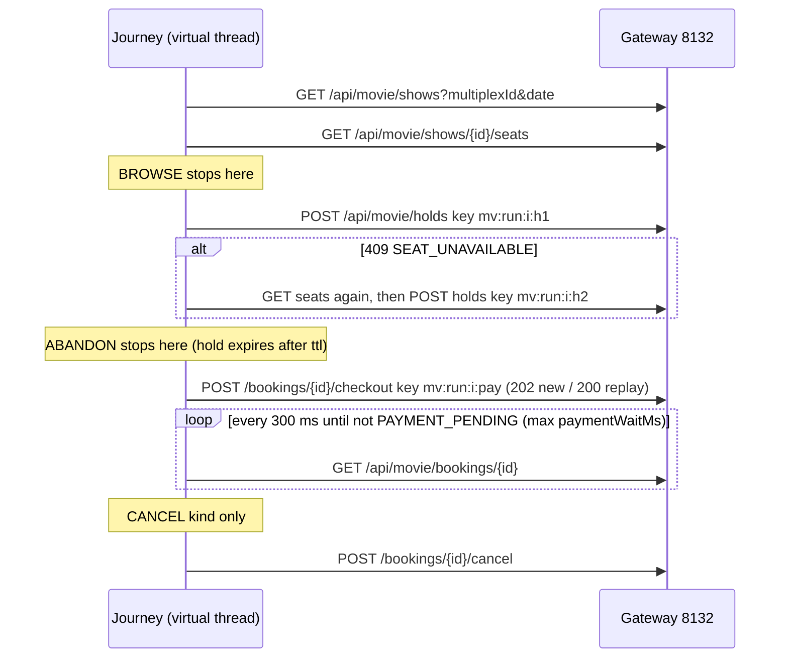

# Movie advance booking: catalog, rolling window, journeys and sizing

Written 2026-10-08 for the work delivered on 2026-10-07 (main commit `834c23b`
and PRs #1–#3). It teaches what the reference docs only list:
[PVR catalog](PVR_CATALOG_SCHEDULE.md), [Ankita PostgreSQL](ANKITA_POSTGRES.md),
[Ankita runbook](../infra/ankita/README.md), [movie API](MOVIE_API_REFERENCE.md) and
the [loader's movie section](../load-tester-java/README.md#movie-advance-booking-journeys-2026-10-07).

Read [movie booking](MOVIE_BOOKING_TUTORIAL.md) first. This tutorial assumes you
know atomic group holds, payment attempts and why the database clock decides expiry.

**How to study it.** There are eight parts. Do one part per sitting, and stop at
each ⏸ pause point. Every part follows the same shape: the idea, an IntelliJ
reading order, one traced example with real numbers, an exercise, what could go
wrong, and interview points. **No exercise needs a running stack or load.** They
are reading and reasoning tasks. Where a command is shown, it is read-only or is
labelled as something to run only when the user selects a live session.

**Evidence boundary.** Every number here is either measured on 2026-10-07 (and
recorded in [project status](PROJECT_STATUS.md) or the run reports under
`load-test/results/java/mv*`) or derived from code. Derived numbers are marked
"estimate". Nothing was executed to write this tutorial.



---

## Part 1 — A permanent catalog from real names

### The idea

The simulation needs realistic inventory: many cinemas, each with several screens,
seat classes and prices. The user chose **real property names with generated
layouts**. A research pass collected 303 PVR/INOX property names in 77 cities
(`docs/data/pvr_properties.csv`, mostly from district.in city pages). No source
stated screen counts, so every layout is synthetic.

A Python script turns the CSV into SQL once, and the SQL ships as Flyway migration
`V7__pvr_catalog_data.sql`. Two properties make that safe:

1. **Deterministic IDs.** Each row's UUID is `uuid5(NAMESPACE, "multiplex/<name>/<city>")`
   (and similarly for screens and movies). uuid5 is a hash of the name, so the same
   input always yields the same ID, on every machine. When Ankita's empty database
   applies V7, it gets *the same* multiplex IDs as Abhishek's, so run reports and
   bookmarks stay meaningful across machines.
2. **A seeded generator.** Layouts come from `random.Random(f"{name}|{city}")`. A
   string seed is hashed with SHA-512 inside Python's `random`, so it is stable
   across runs. (Python's built-in `hash()` of a string is *not* stable, because it
   is salted per process.) Rerunning the script produces byte-identical SQL.

**Why V7 is never edited.** Flyway stores a checksum for every applied migration.
If V7's bytes change, the next API start fails validation on every database that
already applied it, including the retained 1.7 GB local one. To change the
catalog, generate the SQL into a **new** migration (V8, …) that updates or inserts rows.

### IntelliJ reading order

1. [generate_pvr_catalog.py](../scripts/generate_pvr_catalog.py): `uid`, `tier`,
   `screen_count`, `layout`, `category_seats`, then `main`.
2. [V6__movie_catalog_schedule.sql](../src/main/resources/db/migration/V6__movie_catalog_schedule.sql):
   `movie_catalog_sites`, `movie_catalog_prices`, `movie_now_showing`, `movie_purge_log`.
3. `V7__pvr_catalog_data.sql`: skim the first 70 lines (prices, then the slate),
   then one multiplex with its screens and categories.
4. [MovieCatalog](../src/main/java/com/example/booking/MovieCatalog.java):
   `catalogMultiplexes` and `nowShowing`, which back `GET /api/movie/multiplexes?city=`
   and `GET /api/movie/now-showing`.
5. [MovieScheduleIntegrationTest](../src/test/java/com/example/booking/MovieScheduleIntegrationTest.java):
   `permanentCatalogHonoursScreenSeatAndClassRules` and
   `browseListsOnlyCatalogSitesByCityAndTheSlateBlockbustersFirst`.

### Traced example

Counted from V7 (2026-10-08): 303 multiplexes, 1,971 screens, 696,940 seats;
screens span 200–500 seats; 46.2% of screens have two classes (target 45%).
Tier split by city: 163 tier-1 sites, 95 tier-2, 45 tier-3.

Follow one tier-1 screen of 300 seats whose three-class split rolled
A 10% / B 30% / C 60%:

| Step | Code | Result |
| --- | --- | --- |
| Seat count | `rng.randrange(200, 501, 10)` | 300 |
| Split | `layout`: A 8–15, B 25–35, C = rest | 10 / 30 / 60 |
| Seats per class | `category_seats`: floor, last class takes the remainder | A 30, B 90, C 180 |
| Seat numbers (at show creation) | A first, then B, then C | A 1–30, B 31–120, C 121–300 |
| Prices (tier 1, paise) | `PRICES[1]` | A 55000, B 35000, C 22000 |
| Full-house revenue per show | 30×550 + 90×350 + 180×220 | ₹87,600 |

The slate has 20 films with total weight 101. The three blockbusters (weights 15,
13, 12) carry 40/101 ≈ 39.6% of picks.

### Exercise

Without running anything: (a) a new property is appended to the CSV. Which existing
IDs change? (b) Someone reruns the generator and commits the new V7. Write down
exactly what happens on Abhishek's next `up`, and on Ankita's first start against
an empty database. (Answers: (a) none, because IDs hash name and city; (b) Abhishek
fails Flyway validation and the APIs do not start, while Ankita starts fine, so the
two databases now disagree.)

### What could go wrong

- **The generator writes straight into V7.** `TARGET` is hard-coded to
  `V7__pvr_catalog_data.sql`. Rerunning it after a CSV edit silently rewrites an
  applied migration. This is a code defect reported on 2026-10-08 and **not fixed**;
  until it is, redirect the output into a new migration and `git restore` V7.
- uuid5 collisions need identical `(name, city)` keys. The script de-duplicates
  case-insensitively, so two genuinely different cinemas with the same name in the
  same city would collapse into one.
- The catalog is real *names*, not real *capacity*. Do not quote 1,971 screens as
  PVR INOX's actual count. It is close to the reported ~1,800 only by construction.

### Interview points

1. Seed data that must match across environments needs **content-derived IDs**
   (uuid5 or natural keys), not random UUIDs.
2. A migration is an immutable, checksummed fact. Reference data changes ship as
   new migrations, the same as schema changes.
3. Separate *real* attributes from *synthetic* ones and say so. Only the latter
   may be tuned freely.
4. Determinism is a feature you design for: seed by stable keys, sort the inputs,
   and pin the namespace.

⏸ **Pause point.** Explain to yourself why a random UUID per run would break
cross-machine comparisons.

---

## Part 2 — The rolling window fill

### The idea

`MovieScheduleMaintainer` keeps every catalog screen scheduled for **today through
today + 3** in each multiplex's local time zone. On startup and every 15 minutes
(`movie.schedule-interval-ms`, default 900000) it runs `purgePast()` then
`fillWindow()`. It runs on **its own daemon thread**, so a long first fill never
delays the 200 ms payment loop or the 500 ms expiry loop, which share Spring's
single scheduler thread.

The fill is **set-based**: one SQL statement per batch of 3 multiplexes × 1 day
plans the shows, inserts them and inserts their seats. Row-by-row Java inserts
would need about 14 million round trips for the first fill. Inside the statement:

| CTE | Job |
| --- | --- |
| `slate` | Turns movie weights into cumulative `[lo, hi)` ranges with window functions |
| `screen_day` | Every screen in the batch that has **no** show yet on that local day (`NOT EXISTS`), with an opening offset `(hash % 7) * 15` min (09:00–10:30) and a pick hash of screen + date |
| `planned` | Picks the movie whose range contains `pick % total`, sizes the slot as runtime + 20 min rounded up to 5, and uses `generate_series` for every start up to 23:30 |
| `new_shows` | Inserts future slots only; `ON CONFLICT (screen_id, starts_at) DO NOTHING` |
| `new_seats` | Inserts one row per seat for each new show, numbered A then B then C, priced from the site's tier |

**Why it is idempotent.** Two independent guards: the per-screen-day `NOT EXISTS`
skips any screen-day that already has a show, and the `UNIQUE (screen_id, starts_at)`
constraint plus `ON CONFLICT DO NOTHING` absorbs a race. A fill interrupted halfway
resumes cleanly: finished screen-days are skipped, unfinished ones are filled.

**Why the plan is deterministic.** The movie and opening time come from
`hashtext(screen_id || '/' || date)` and `hashtext(screen_id)`, not from `random()`.
Refilling the same day reproduces the same plan.

**Why an advisory lock.** Both APIs run the maintainer (`MOVIE_SCHEDULE_ENABLED`
sits in the shared `&api-env` anchor in `compose.yml`). Each batch transaction first
calls `pg_try_advisory_xact_lock(0x4d6f766965)` (hex for "Movie"). The replica that
fails to get it returns `null`, and `fillWindow` stops for that tick. The lock only
avoids *duplicated work*; correctness already comes from the two guards above.

### IntelliJ reading order

1. [MovieScheduleMaintainer](../src/main/java/com/example/booking/MovieScheduleMaintainer.java):
   constants, then `start`, `tick`, `fillWindow`, `fill` and `locked`.
2. [BookingStore](../src/main/java/com/example/booking/BookingStore.java): `tx`
   (2 s `lock_timeout`, 3 s `statement_timeout`, 5 s transaction timeout).
3. [application.yml](../src/main/resources/application.yml): the `movie.*` keys.
4. [compose.yml](../compose.yml): the `&api-env` anchor and `<<: *api-env` in api-b.
5. Test: `fillIsIdempotentAndBuildsNonOverlappingPricedShowsInsideOpeningHours`
   and `replicaWithoutTheMaintainerLockSkipsWork`.

Debugger tip: break in `fill` on the `queryForMap` line and inspect `day` and
`multiplexes`. Do not pause inside the transaction for long: you hold the advisory
lock, and the 5 s transaction timeout will fire.

### Traced example

One screen with `open_offset` = 2 × 15 = 30 min, picked "Sindoor Ki Saugandh"
(168 min):

- Slot = ceil((168 + 20) / 5) × 5 = **190 min**.
- `k` runs from 0 to (1410 − 540 − 30) / 190 = 4.4, so k = 0..4: **5 shows** at
  09:30, 12:40, 15:50, 19:00 and 22:10 IST.
- The 22:10 show ends at 00:58 and occupies the screen until 01:18. It still
  belongs to its *start* date.
- Shortest film (98 min, 118 → 120 min slot) from 09:00: k = 0..7, **8 shows**.
  Longest (175 min, 195 min slot) from 10:30: k = 0..4, **5 shows**.

Measured first tick (2026-10-07, API B, empty window): **40,333 shows and
14,254,490 seat rows in 467.8 s**. That is 404 batches (101 batches of 3 sites ×
4 days), about 1.16 s each on average (estimate). Per day: 7 Oct 7,236 (future
slots only), 8 Oct 11,026, 9 Oct 11,046, 10 Oct 11,027. The SQL audit found 0
seat-count mismatches, 0 overlaps and 0 past shows. The database grew from 9.5 MB
to 1,723 MB.

### Exercise

Two replicas start at the same moment. Replica A takes the lock on batch 1.
(a) What does replica B do on this tick? (b) 15 minutes later, the two ticks no
longer overlap. Does work get duplicated? (c) Explain why the result would still
be correct if `locked()` always returned true. (Answers: (a) `fill` returns null,
so B skips the rest of its tick; (b) the second replica's batches all hit
`NOT EXISTS` and insert nothing, which costs little; (c) `NOT EXISTS` plus
`ON CONFLICT`.)

### What could go wrong

- **One slow batch can stall the whole window.** A batch must finish within the
  3 s `statement_timeout`. A failure aborts the tick, and the next tick starts again
  from batch 1, reaching the same slow batch. On slower hardware (for example
  Ankita) a batch that *consistently* exceeds 3 s would block every later batch.
  Watch for repeated `Movie schedule tick will retry` warnings.
- `hashtext` is an internal PostgreSQL function. Its output is stable within a
  major version, but it is not a documented contract. A different major version
  could plan different movies for future days. Existing rows never change.
- The advisory xact lock is per batch, not per tick. It is not leader election:
  two replicas whose ticks do not overlap both run. That is fine here only because
  the fill is idempotent.

### Interview points

1. Prefer one set-based statement over N round trips. Choose the batch size to fit
   the existing timeouts, rather than raising timeouts to fit the batch.
2. Idempotency comes from the data model (unique key plus existence check). The
   lock is an optimisation for duplicated work, not a correctness mechanism.
3. Deterministic hashing beats `random()` for anything you may need to regenerate
   or compare.
4. Background maintenance gets its own thread or executor, so it cannot starve
   latency-sensitive scheduled loops.
5. Pre-materialising seats makes cost explicit: about 3.5M seat rows per day here
   (estimate: 14.25M / 4), which is why the purge matters.

⏸ **Pause point.**

---

## Part 3 — The purge

### The idea

Every tick first deletes every show that started before **today's local midnight**,
together with everything that depends on it. This keeps the database close to a
steady 4-day size. The user chose whole-day deletion, including bookings and payments.

The dependency graph (from V5) contains a cycle:



`purgeBatch` deletes all seven tables in **one statement** made of data-modifying
CTEs. All foreign keys here are the default `NO ACTION`, which PostgreSQL checks
**at the end of the statement**, not row by row. By the end, the parents and children
are all gone, so the checks pass, including across the bookings ↔ payments cycle.
With `RESTRICT`, or with seven separate statements, you would have to order the
deletes and break the cycle by hand (for example, null `current_payment_id` first).

Two more details:

- **All CTEs see the same snapshot.** The `doomed`/`bk`/`pay` selects are computed
  once, and the deletes cannot see each other's effects. `RETURNING` is the only way
  to pass rows between them, which is how the payment `refund_required` flags reach
  the final count.
- **Index support.** Deleting a parent makes PostgreSQL look up referencing child
  rows. V6 adds indexes on `movie_bookings(show_id)`,
  `movie_booking_seats(show_id, seat_number)` and `movie_booking_audit(booking_id)`.
  Without them, every batch would sequentially scan millions of rows.

**Open payments are kept.** A show is excluded from `doomed` if any of its bookings
has a `PENDING`/`RETRY_PENDING` payment. Deleting it would race the payment worker,
which may be holding a lease and is about to apply a provider receipt. The show is
purged on a later tick, after the worker settles it.

**Refund accounting.** `refund_required` payments *are* deleted (the user chose
this), but each batch first counts them into `movie_purge_log.refunds_required`.
After that, nothing else records the liability, so a real system would export it first.

### IntelliJ reading order

1. `MovieScheduleMaintainer.purgePast`, then `purgeBatch`.
2. [V5__movie_booking.sql](../src/main/resources/db/migration/V5__movie_booking.sql):
   every `REFERENCES` and the `ALTER TABLE … ADD FOREIGN KEY` that closes the cycle.
3. V6: the four `CREATE INDEX` lines and their comment.
4. Test: `purgeRemovesPastDaysWithEveryDependentRowButKeepsTodayAndOpenPayments`.
   Note how it moves two shows back by two days to make them "past".

### Traced example

The first live tick on 2026-10-07 found one leftover fixture show from an earlier
day. It purged **1 show, 2 bookings, 3 payments, 1 refund-required** in one batch,
and wrote one `movie_purge_log` row. In the test, show `open` has a pending payment
and survives `purgePast()`, show `settled` disappears with its receipts, and a
second `purgePast()` returns 0 shows.

### Exercise

Rewrite `purgeBatch` mentally as seven separate `DELETE` statements in one
transaction. Write down the order that works, and the extra `UPDATE` you need
first. Then explain what happens if one of those foreign keys were declared
`DEFERRABLE INITIALLY DEFERRED` instead.

### What could go wrong

- Demo shows created through `POST /api/demo/movie/shows` are purged too. The rule
  applies to *all* movie shows, not just catalog ones.
- A show stuck with a never-settling payment is never purged. That is visible as a
  past show in `SELECT … WHERE starts_at < today`.
- Purging refund obligations loses money-relevant facts. The counter makes the loss
  visible but does not preserve the detail.

### Interview points

1. `NO ACTION` foreign keys are checked at statement end, so one multi-table delete
   can remove a cyclic graph. `RESTRICT` checks immediately.
2. Every foreign key you delete through needs an index on the *child* columns.
3. Retention is a domain decision: never delete in-flight work that another
   component owns. Here that means open payments.
4. Count (or archive) liabilities before deleting them, and log each purge.

⏸ **Pause point.**

---

## Part 4 — The booking window

### The idea

Shows exist for today..today+3, and holds may be placed only in that window.
`MovieBookingService.hold`, after locking the requested seats, runs:

```sql
SELECT (sh.starts_at AT TIME ZONE mx.zone_id)::date
       <= (clock_timestamp() AT TIME ZONE mx.zone_id)::date + ?   -- windowDays
```

If false, it returns **`409 SHOW_NOT_YET_OPEN`** ("Booking opens 3 days before the
show's local date"). The exception is thrown inside the transaction, so the seat
locks roll back and no booking row is written. The check before it returns
`409 SHOW_STARTED` for a show that has already started.

**Local date, not UTC.** "Three days ahead" is a business rule about the cinema's
calendar, so both sides convert to the multiplex's IANA zone before taking `::date`.

**Database clock, not the JVM clock.** The two replicas' JVM clocks can disagree,
and a laptop clock can drift. `clock_timestamp()` comes from the database that also
stores the booking, so every replica and the maintainer agree on what "today" is.

`movie.booking-window-days` (`MOVIE_BOOKING_WINDOW_DAYS`, default 3) drives **both**
the fill horizon and this rule, so they cannot drift apart.

### IntelliJ reading order

1. [MovieBookingService](../src/main/java/com/example/booking/MovieBookingService.java):
   constructor (`@Value("${movie.booking-window-days:3}")`), then `hold`, from the
   advisory key lock through `SHOW_NOT_YET_OPEN`.
2. `MovieScheduleMaintainer.fillWindow`: the same `windowDays` and the same
   `clock_timestamp() AT TIME ZONE ?` idiom.
3. [MovieSpec](../load-tester-java/src/main/java/com/example/bookingload/MovieSpec.java)
   `normalized`: the loader refuses dates outside today..today+3 before sending
   anything, as a client-side courtesy. The server stays authoritative.
4. Test: `holdsOpenThreeLocalDaysAheadAndNotBeyond`.

### Traced example

At **2026-10-08 02:00 IST** (= 2026-10-07 20:30 UTC), a buyer tries a show at
**2026-10-11 21:00 IST**:

| Computed in | "today" | today + 3 | show date | Result |
| --- | --- | --- | --- | --- |
| IST (the code) | 10-08 | 10-11 | 10-11 | allowed ✔ |
| UTC (a bug) | 10-07 | 10-10 | 10-11 (15:30 UTC) | 409 ✘, wrongly |

A UTC implementation would wrongly reject such holds every night between 00:00 and
05:30 IST.

### Exercise

(a) Why does the check run *after* `lockSeats` rather than before? Is the order
wrong? (Hint: what does a rollback cost here, and what would a pre-check without
locks gain?) (b) An Ankita operator sets `MOVIE_BOOKING_WINDOW_DAYS=5` on API A
only. Describe what buyers see through the gateway.

### What could go wrong

- Different window settings on different replicas give answers that depend on
  which replica serves the request. Keep the setting in the shared anchor.
- `clock_timestamp()` advances during a transaction; `now()` does not. For a
  calendar-day rule the difference only matters exactly at midnight.
- The window is enforced on hold only. Browsing and seat maps work for any show
  that exists, such as manually created demo shows further out.

### Interview points

1. Business dates live in the venue's time zone. Store instants, and convert at
   the edge of the rule.
2. Use one clock for decisions, the database's, and keep the decision in the same
   transaction that writes.
3. One configuration value should drive the related behaviours (the fill horizon
   and the hold rule), so they cannot disagree.
4. Client-side validation is a courtesy; the server rule is the contract (409 with
   a stable error code).

⏸ **Pause point.**

---

## Part 5 — Case study: the JIT CPU incident

A debugging method in five steps, using what happened on 2026-10-07.

### 1. Symptom

Before any load test, the loader's observer refused to start: **SERVER_CPU**.
PostgreSQL was using a full core with **no user traffic**. Only the maintainer was running.

### 2. A hypothesis, and testing it

The first hypothesis was **autovacuum**: 14M fresh seat rows invite vacuum and
analyze work. It was wrong: the cost turned out to be in the maintainer's own
statements (step 3). How it was ruled out was not recorded. The lesson: write down
the hypothesis *and* the observation that would disprove it (for example, whether
`pg_stat_activity` shows autovacuum workers or the maintainer's statement while
CPU is high) before acting on it.

### 3. Evidence

Each fill batch was timed with and without JIT on an already-filled day, so every
batch was a no-op:

| Setting | Time per no-op batch |
| --- | --- |
| JIT on (default) | **733 ms** |
| `SET jit = off` | **8.4 ms** |

Why: when `generate_series` gets its arguments from other columns (here
`slot.minutes` and `open_offset`), the planner cannot know how many rows it returns,
so it assumes a default (1000 rows per call). Nested twice, for shows and then
seats, that inflates the estimated cost far beyond PostgreSQL's JIT thresholds
(`jit_above_cost` 100000; inlining and optimisation at 500000). So *every* batch
paid LLVM compile time, even when `NOT EXISTS` meant it would insert nothing.
Estimate: 404 batches × 0.733 s ≈ **5 minutes of one busy core per tick per
replica**. Two replicas with independent 15-minute phases keep a core busy most of
the time.

What to look for in `EXPLAIN (ANALYZE)` output is a `JIT:` block at the end. The
raw output from 2026-10-07 was not saved, so this shows only the shape, not the
measured values:

```text
 JIT:
   Functions: …
   Options: Inlining true, Optimization true, Expressions true, Deforming true
   Timing: Generation … ms, Inlining … ms, Optimization … ms, Emission … ms, Total … ms
```

If "Total" dwarfs "Execution Time", you are paying for compilation, not work.
Careful: `EXPLAIN ANALYZE` *executes* the statement, including its INSERTs. Wrap it
in `BEGIN … ROLLBACK`, or use a day that is already filled.

### 4. The fix, and why this one

`locked()` now runs `SET LOCAL jit = off` right after taking the advisory lock.
`LOCAL` scopes it to that batch transaction only, so API queries keep JIT, and no
server-wide setting changes. The alternatives were worse. Raising `jit_above_cost`
globally would affect every query. Fixing the estimates (for example, a support
function or materialised slot tables) would mean more code for the same result.

### 5. Verify the deployed artifact, not your source: the stale-jar trap

The first "fixed" claim was **wrong**. After editing the code, `mvn test` passed,
the image was rebuilt and CPU looked low. But `mvn test` stops before the `package`
phase, so `target/sd-book-my-show-1.0.0.jar` was still the old jar, and the
Dockerfile's `COPY target/sd-book-my-show-1.0.0.jar` shipped old code. The low CPU
reading was coincidence. The real fix was packaged (`-DskipTests` package), deployed,
and then **verified inside the running image**: the deployed class contained
`jit = off`, and PostgreSQL sat at 3.5% CPU after the startup tick. The fix shipped
on main as `834c23b`. The branch commit `46ff584` named in older notes was squashed.

The same trap appeared again in the 2026-10-08 review: Compose says the loader has
1 CPU, but `docker inspect` showed the container that ran the movie tests had 0.5
CPU, because it was created before the change ([part 7](#part-7--sizing-containers)).

### IntelliJ reading order

1. `MovieScheduleMaintainer.locked` and its Javadoc (the measurement is recorded there).
2. `MovieScheduleMaintainer.fill`: find the two `generate_series` calls whose
   arguments are column references.
3. [Dockerfile](../Dockerfile): the `COPY target/...jar` line. Ask what produces it.

### Exercise

Write the one-line check you would use to prove the running API contains the fix,
*without* trusting the build log. (One answer, to run only in a selected live
session: `docker compose exec api-a sh -c "unzip -p app.jar BOOT-INF/classes/com/example/booking/MovieScheduleMaintainer.class | grep -a -c 'jit = off'"`,
which should print 1.)
Then list two other places in this repository where "built" might not equal "running".

### What could go wrong

- Disabling JIT is right for this short, write-heavy statement. It is not a general
  rule: long analytical queries can benefit from JIT.
- Treating the absence of a symptom as proof of a fix. Verify the mechanism
  (the deployed bytes, the setting inside the transaction), not only the outcome.

### Interview points

1. Symptom → falsifiable hypothesis → evidence → narrow fix → **verify the
   deployed artifact**.
2. JIT cost is paid at plan time. Row-estimate errors from set-returning functions
   can trigger it for statements that do almost no work.
3. Prefer the narrowest scope for a fix (`SET LOCAL` in one transaction) over a
   global setting.
4. `mvn test` does not repackage. Any image that `COPY`s a jar needs `package` first,
   and then a check of the bytes inside the image.
5. Record wrong turns in the write-up. They teach more than the final answer.

⏸ **Pause point.**

---

## Part 6 — The movie journey workload

### The idea

`POST /load/movie-runs` (control port 8135) runs a finite simulation. Each arrival
is one user journey, executed sequentially on its own virtual thread:



**Open model.** Arrival *i* is due at `start + i / rate`, whether or not earlier
journeys have finished. A closed model (N users who wait for each response) quietly
lowers offered load when the server slows down, which hides the problem being
measured. If the generator falls more than 500 ms behind schedule it stops with
`SCHEDULER_LAG` rather than silently sending less.

**Virtual threads versus the semaphore.** One virtual thread per journey makes
waiting cheap: a parked journey costs little memory and no OS thread. It does not
make the server faster. A shared `Semaphore(concurrency)` (default 16) bounds
**concurrent HTTP calls**. A journey holds a permit only during a call, never while
sleeping between polls. If a permit is unavailable for 2 s, the run stops with
`GENERATOR_SATURATED`, and it also stops at 400 live journeys. The bound stays
explicit; there is no hidden queue.

**Idempotency keys.**

| Step | Key | On 409 | On timeout / 408 / 5xx (ambiguous) |
| --- | --- | --- | --- |
| Hold, try 1 | `mv:<run>:<i>:h1` | `SEAT_UNAVAILABLE` → reread the seat map, try 2 | `UNKNOWN_HOLD`, stop the journey |
| Hold, try 2 | `mv:<run>:<i>:h2` | `SEAT_CONFLICT`, stop | `UNKNOWN_HOLD`, stop |
| Checkout | `mv:<run>:<i>:pay` | `CHECKOUT_REJECTED` | `UNKNOWN_PAYMENT`, stop |

- A **seat conflict is definite**: nothing was committed, so a *new* key for
  *different* seats is safe. Reusing `:h1` with a different seat set would get
  `409 IDEMPOTENCY_CONFLICT`, because a hold key binds show, seat set and TTL.
- A **timeout is ambiguous**: the hold or payment may have committed. A fresh-key
  retry could create a second hold or payment for the same user. A same-key retry
  *would* be safe (the server replays it), but this workload deliberately records
  `UNKNOWN_*` and never retries. Retry policy is the generic runner's experiment
  variable, and the movie run keeps one attempt per key so its counts stay honest.

**The 202/200 contract bug.** `MovieController.checkout` returns **202** for a newly
admitted payment and **200** for a replay. The first loader version expected 201. In
smoke 1, all 77 checkouts returned 202 and the loader marked them `CHECKOUT_REJECTED`
without polling, yet the server confirmed all 77. A client misreading a response
does not change server state. The fix accepts 202 or 200, and the test stub in
`MovieLoadTest` now returns 202. A hand-written stub can only check what its author
believed, which is why it agreed with the bug.

### IntelliJ reading order

1. [MovieSpec](../load-tester-java/src/main/java/com/example/bookingload/MovieSpec.java):
   `normalized` defaults (rate 5, seconds 60, concurrency 16, ttl 120 s, timeout
   3.5 s, payment wait 15 s, seed 20261007) and the local/remote caps (20 vs 50/s,
   600 vs 1800 s, 12k vs 90k journeys, 16 vs 64 calls).
2. [MovieRunController](../load-tester-java/src/main/java/com/example/bookingload/MovieRunController.java):
   202 on start; 400/409/404 handlers.
3. [MovieRunService](../load-tester-java/src/main/java/com/example/bookingload/MovieRunService.java):
   `start` → `execute` (arrival loop and stop guards) → `journey` → `call`
   (semaphore, transient streak) → `finish` (report).
4. [MovieChoices](../load-tester-java/src/main/java/com/example/bookingload/MovieChoices.java):
   `kind`, `groupSize` (weights 8/32/18/20/8/6/3/2/1/2), `show` (hot users want
   blockbusters 17:00–22:00 IST; shows starting within 10 min are skipped),
   `seats` (adjacent seats in one class, preferring B 50 / C 30 / A 20).
5. [RunSlot](../load-tester-java/src/main/java/com/example/bookingload/RunSlot.java):
   one finite run at a time across the generic and movie runners.
6. [MovieLoadTest](../load-tester-java/src/test/java/com/example/bookingload/MovieLoadTest.java):
   the five tests, and the stub's `handle` method.

### Traced example: reading the stopped 537-journey run

`load-test/results/java/mvf14a8cd8215544/report.json`, started
2026-10-07T09:45:32Z, request `rate 20, seconds 300`, date 2026-10-08:

| Field | Value | How to read it |
| --- | --- | --- |
| `state` / `stopReason` | STOPPED / USER_STOP | The user stopped it after about 27 s |
| `scheduled` / `started` | 6000 / 537 | 537 ≈ 20/s × 27 s |
| `kinds` | BOOK 344, CANCEL 61, ABANDON 79, BROWSE 53 | ≈ 64/11/15/10%, matching the 65/10/15/10 mix |
| `outcomes` | CONFIRMED 339, CANCELLED 60, ABANDONED 79, BROWSED 53, STOPPED_AT_POLL 6 | The 6 were 5 BOOK + 1 CANCEL, stopped mid-poll |
| `steps` | SHOWS 537, SEATS 537, HOLD 484, CHECKOUT 405 (all 202), POLL 436, CANCEL 60 | These sum to `httpCalls` 2,459 |
| HOLD latency | p50 9.0 ms, p95 32.6 ms, max 99.3 ms | Gateway round trip seen by the loader |
| `maxLiveJourneys` | 11 | Little's law: 20/s × 0.28 s average journey ≈ 5.7 average live |
| `journeyLatencyMs` | p50 332 ms, p95 422 ms | Dominated by the 300 ms poll sleep |
| `confirmedSeats` / revenue | 1,192 seats / 40,257,000 paise (₹402,570) | Average ₹338 per seat |
| `callsPerSecond` | 81–105 per second | About 4.6 calls per journey × 20/s |

Checks you can make with arithmetic alone:

- HOLD 484 = 537 − 53 BROWSE, so **no journey needed `:h2`**. With 40k shows, a
  27-second run never contended for seats. The fresh-key path was exercised only
  by unit tests.
- CHECKOUT 405 = 344 BOOK + 61 CANCEL. Every checkout returned 202.
- **Reconciling with the database.** Holds across the three movie runs:
  89 (smoke 1) + 89 (smoke 2) + 484 (main) = **662**. The database showed
  482 CONFIRMED + 76 CANCELLED + 104 EXPIRED = **662**. ✔ Breakdown:
  CONFIRMED = 77 (smoke 1, server-side) + 61 + 339 + 5 of the 6 stopped mid-poll;
  CANCELLED = 16 + 60; EXPIRED = 12 + 12 + 79 abandoned + 1. That last one is
  consistent with a stopped journey whose payment failed and whose hold then
  expired. This is inferred from the counts, not observed directly.

Caveat recorded on 2026-10-08: the loader container used for smoke 2 and this run
had **0.5 CPU and `-Xmx192m`**, not the 1 CPU now in `compose.local.yml`.

### Exercise

(a) Set `concurrency` to 2 at 20/s in your head. Using the step latencies above,
predict whether `GENERATOR_SATURATED` fires. (b) Explain why stopping the run left
6 journeys whose server-side state the loader never learned, and how you found
their outcome anyway. (c) Why does an ABANDON journey become EXPIRED in the
database about 120 s later?

### What could go wrong

- Reading `CHECKOUT_REJECTED` as a server failure: in smoke 1 it was a client
  contract bug. Always reconcile client outcomes with database state.
- A stub that mirrors the client's assumptions. Contract tests should be derived
  from the server (its controller, or a recorded response).
- Reading this local, 27-second, uncontended run as capacity. It shows correctness
  under light load: all 2,459 calls returned 2xx and no seat was double-sold.

### Interview points

1. Open-model arrivals keep offered load honest. Fail loudly when the generator
   cannot keep the schedule.
2. Virtual threads make waiting cheap. A semaphore bounds the work you push
   downstream. They solve different problems.
3. A definite 409 permits a fresh-key retry. An ambiguous timeout permits only a
   same-key retry or discovery, never a new key.
4. Client-observed outcomes are claims. The database is the ledger; reconcile the two.
5. Contract tests must come from the provider. A stub written by the consumer
   repeats the consumer's misunderstanding.

⏸ **Pause point.**

---

## Part 7 — Sizing containers

### The idea

Two limits, two different mechanisms (cgroup v2):

| Compose key | cgroup file | Behaviour when exceeded |
| --- | --- | --- |
| `mem_limit: 3g` | `memory.max` | Hard cap. The kernel OOM-kills the process: exit **137** (128 + SIGKILL 9) |
| `memswap_limit: 4g` | memory + swap total | 4 GB *total*, i.e. 1 GB of swap beyond RAM |
| `cpus: 2.0` | `cpu.max` quota | **Throttled**, not killed. A quota caps usage; it reserves nothing |

A container *stopped* normally exits **143** (128 + SIGTERM 15). That is what
`docker ps` showed for the APIs on 2026-10-08: a clean stop, not a crash.

**How the JVM sizes itself.** The JVM reads the cgroup limits:

- **Heap** = `MaxRAMPercentage` × the memory limit. API: 60% × 512 MiB ≈ **307 MiB**.
  The remaining ~200 MiB covers metaspace, code cache, thread stacks and direct
  buffers. Loader: 50% × 384 MiB ≈ **192 MiB**.
- **CPUs** = the quota, rounded up. With `cpus: 1.0`, `availableProcessors()` is 1.
  Without a limit, the JVM saw all **16 host CPUs** and sized GC threads, the
  common pool and the virtual-thread scheduler accordingly.
- **GC.** The JVM picks G1 only on a "server-class machine" (≥ 2 CPUs and ≥ about
  1792 MB). Below that it picks Serial. The API Dockerfile sets `-XX:+UseSerialGC`
  explicitly, so raising the CPU or memory limit later cannot silently switch the
  collector.

**PostgreSQL's 3 GB / 2 CPU budget** (`compose.yml`):

| Setting | Value | Reasoning |
| --- | --- | --- |
| `shared_buffers` | 768MB | ~25% of the limit, the usual starting point |
| `effective_cache_size` | 2GB | A planner *hint* about OS page cache; allocates nothing |
| `work_mem` | 16MB | Per sort or hash node, per backend. 2 APIs × Hikari pool 8 = 16 connections, so a few nodes each stays within a few hundred MB |
| `maintenance_work_mem` | 256MB | Index builds and vacuum after a 14M-row fill |
| `shm_size` | 256mb | Parallel queries use `/dev/shm`. Docker's 64 MB default is too small at this `work_mem` |
| `cpus` | 2.0 | One core for the maintainer or a burst, one for API traffic |

### IntelliJ reading order

1. [compose.yml](../compose.yml): the postgres `command`, `shm_size`, `mem_limit`,
   `memswap_limit`, `cpus`; the API limits.
2. [Dockerfile](../Dockerfile): `JAVA_TOOL_OPTIONS` and its comment.
3. [compose.failover.yml](../compose.failover.yml): gateway 96m / 0.5 CPU.
4. [load-tester-java/Dockerfile](../load-tester-java/Dockerfile) and
   [compose.local.yml](../load-tester-java/compose.local.yml) /
   [compose.ankita.yml](../load-tester-java/compose.ankita.yml): 1 CPU locally,
   0.5 on Ankita.
5. `application.yml`: `spring.datasource.hikari.maximum-pool-size: 8`.

### Traced example: what is configured versus what is applied

Read-only `docker inspect` on 2026-10-08:

| Container | Memory (bytes) | NanoCpus | Notes |
| --- | --- | --- | --- |
| postgres | 3,221,225,472 (3 GiB) | 2,000,000,000 | swap total 4 GiB, shm 268,435,456 |
| api-a / api-b | 536,870,912 (512 MiB) | 1,000,000,000 | `MaxRAMPercentage=60 -XX:+UseSerialGC`, schedule on |
| gateway | 100,663,296 (96 MiB) | 500,000,000 | |
| java loader | 402,653,184 (384 MiB) | **500,000,000** | **`-Xmx192m`** from an older image |

The loader row disagrees with the committed files: `compose.local.yml` says
`cpus: 1.0`, and the Dockerfile no longer has `-Xmx`. The container was created at
2026-10-07T09:44Z from an earlier image and never recreated. Compose changes apply
only when a container is (re)created. This is the same lesson as the stale jar.

### Exercise

Read-only reasoning: (a) an API needs 350 MB of live heap during a burst. What
happens, and which exit code would you expect if the container's total RSS passes
512 MiB? (b) Someone raises the API to 2 CPUs and 2 GB but removes `UseSerialGC`.
Which collector will the JVM choose? (c) Write the `docker inspect -f` template that
proves a container's CPU limit. Only in a selected live session would you run
`docker run --rm --cpus 1 -m 512m --entrypoint java <api-image> -XX:+PrintFlagsFinal -version`
and look at `MaxHeapSize` and `UseSerialGC`.

### What could go wrong

- Memory limit without a heap percentage: the JVM's 25% default wastes the
  container. Too high a percentage leaves no non-heap room, so the process is
  OOM-killed (137) instead of throwing `OutOfMemoryError`.
- A CPU quota hides throttling. A latency spike may be `cpu.stat nr_throttled`,
  not slow code.
- `effective_cache_size` sized as if it were allocated memory, or `work_mem` sized
  without counting connections and nodes.
- Trusting Compose files over `docker inspect`.

### Interview points

1. Memory limits kill and CPU limits throttle. Design for both differently.
2. Containerised JVMs size heap, CPU count and GC from cgroups. Pin the important
   choices (heap percentage, GC) explicitly.
3. Database memory is per-connection times per-node, plus shared buffers. Budget
   from the pool size.
4. Verify applied limits with `docker inspect`. Configuration is only a request
   until the container is recreated.

⏸ **Pause point.**

---

## Part 8 — The database on another machine

### The idea

The plan (scripted on 2026-10-07, **never executed**): Ankita (100.84.247.65) hosts
only PostgreSQL. Abhishek (100.103.238.2) keeps API A/B and the gateway, and points
them at Ankita over Tailscale. Flyway builds the fresh schema (V1–V7, the same
deterministic catalog IDs) on first connect, then the maintainer fills the window.

```text
Abhishek                                         Ankita
gateway 8132 -> api-a / api-b  -- Tailscale -->  postgres :5553 on <tailscale-ip> only
local postgres: stopped, volume kept             firewall: TCP 5553 from 100.64.0.0/10
```

**Bind address versus firewall (defence in depth).**
`infra/ankita/compose.postgres.yml` publishes `${TAILSCALE_IP}:5553:5432`, so the
socket listens only on the tailnet interface. `start-postgres.ps1` also adds a
Windows Firewall rule allowing TCP 5553 only from `100.64.0.0/10`, Tailscale's
CGNAT range. If Docker Desktop cannot bind a specific IP, the fallback is
`5553:5432` plus the firewall alone, so the firewall is the layer that must hold.

**Credentials.** `postgres`/`postgres` (the user's choice on 2026-10-07), with
scram-sha-256 host authentication. The trade-off: setup is trivial, but any device
on the tailnet can log in as superuser. Reachability is the only protection.
Tailscale ACLs or a non-superuser role would be the next step.

**Timeouts over a network.** `compose.remote-db.yml` sets the JDBC
`connectTimeout=5` and `socketTimeout=10` (local: 3 and 5).
`depends_on: !reset {}` removes the wait on the local postgres service.
Inside each transaction, `BookingStore.tx` still sets `lock_timeout 2s` and
`statement_timeout 3s`. Both are measured **on the server**, so network time does
not count against them. The Spring transaction timeout of **5 s** is measured on
the client and *does* include every network round trip.

### IntelliJ reading order

1. [compose.remote-db.yml](../compose.remote-db.yml).
2. [infra/ankita/compose.postgres.yml](../infra/ankita/compose.postgres.yml) and
   [start-postgres.ps1](../infra/ankita/start-postgres.ps1): the IP check, `.env`,
   the firewall rule.
3. [scripts/use-remote-db.ps1](../scripts/use-remote-db.ps1): `tailscale ping`,
   `pg_isready` from a container, the Compose files, stopping local postgres.
4. `BookingStore.tx` and `MovieBookingService.hold`: count the statements.
5. Runbook: [infra/ankita/README.md](../infra/ankita/README.md).

### Traced example: latency × round trips (estimates)

Counted from the code, a new hold of *n* seats makes about **14 + 2n sequential
round trips** (two `SET LOCAL`, advisory lock, key lookup, show lookup, seat locks,
two date checks, ownership read, booking insert, two writes per seat, audit, two
reads for the response, commit; ±1).

| Path | Round trip | 3-seat hold (20 RTT) | 10-seat hold (34 RTT) |
| --- | --- | --- | --- |
| Local Docker | <1 ms | ~10 ms (the measured p50 was 9.0 ms) | — |
| Tailscale direct | ~3 ms | +60 ms | +100 ms |
| Tailscale via DERP relay | 50–200 ms (say 150) | **+3.0 s** | **+5.1 s**, beyond the 5 s transaction timeout |

So the runbook's "expect higher latency rather than new failures" holds for a direct
path. Over DERP, large groups would fail on the 5 s transaction timeout. Seat row
locks would also be held for seconds, which raises contention on popular shows.
Run `tailscale ping` first: "via DERP" means relayed.

The first fill over Tailscale: about 6 round trips per batch × 404 batches ≈ 2,400
RTT. That is about 7 s extra on a direct path, or about 6 minutes via DERP, on top
of Ankita's own execution time (unknown; 467.8 s on Abhishek).

**Availability.** If Ankita sleeps or loses Wi-Fi, the API readiness check (which
includes the database) fails, the gateway marks both APIs down, and holds and
payments stop. Nothing is lost: PostgreSQL is authoritative and Hikari reconnects.
The maintainer's tick fails and retries 15 minutes later. The database is now a
single point of failure on a laptop.

### Exercise

(a) Using the table, find the largest group a buyer can reliably hold over a
150 ms DERP path. (b) Which single setting would you change first, and what would
it cost? (c) Why does `use-remote-db.ps1` run `pg_isready` from *inside a
container* rather than from the Windows shell?

### What could go wrong

- Assuming server-side timeouts cover network time. Only the client-side
  transaction timeout does.
- Publishing 5553 on `0.0.0.0` or the LAN with superuser `postgres`/`postgres`.
- A changed Tailscale IP: rerun `start-postgres.ps1`, which rewrites `.env`.
- Fill batches near the 3 s `statement_timeout` on slower hardware stall the window
  ([part 2](#part-2--the-rolling-window-fill)).

### Interview points

1. Chatty transactions multiply round-trip time. Moving a database farther away
   costs RTT × statements, and lock hold time grows with it.
2. Know which timeouts are server-side (statement, lock) and which are client-side
   (transaction, socket).
3. Layer exposure controls (bind address, firewall, credentials, ACLs). Say which
   layer you are relying on.
4. Moving the database to another host moves the single point of failure. Plan for
   sleep and disconnects, and make reconnection automatic.
5. Measure the path (direct versus relayed) before interpreting latency.

---

## Where to go next

- Study order across all tutorials: [study path](PROJECT_STATUS.md#study-path).
- Interview practice: [interview guide, advance-booking track](INTERVIEW_GUIDE.md#movie-advance-booking-track).
- Not built yet: SSE/live availability, waiting rooms, shared admission and Redis
  ([future work](FUTURE_WORK.md)). Running the Ankita database is a separate user
  selection.
