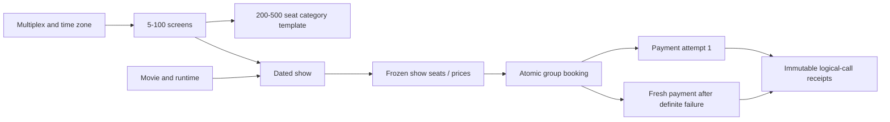
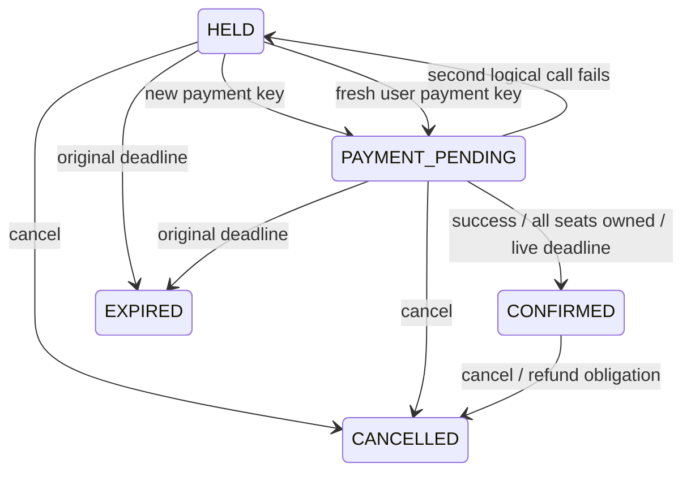

# Movie booking: shows, atomic seat groups and payment retries

This is the current backend domain at `D:/sd-book-my-show`. The inherited generic
ticketing endpoints/studies remain separately available. The movie expansion is
new October 5 work; it is not backdated into the reconstructed source schedule.
Read [the movie API reference](MOVIE_API_REFERENCE.md) alongside this walkthrough.

## Your requirements

| Requirement | Implementation |
| --- | --- |
|5-100 screens/multiplex | List of uniquely named screens, validated at creation |
|200-500 seats/screen | Stored capacity and a numbered layout |
|Two or three categories | Positive A/B/C percentages adding to 100 |
|A10/B20/C70 roughly | Default layout; rounding remainder goes to the final category |
|Multiple shows on the same day | Separate show inventory and multiplex-local date listing |
|Multiple selected seats |1-10 seats, all-or-nothing reservation |
|95% first call, another 4.5% retry,0.5% fail | Stored mock plan; one logical automatic retry |
|Failed payment retains seats | HELD until original expiry; fresh key creates a fresh payment |
|Thousands of users later | [Saved simulation plan](MOVIE_LOAD_SIMULATION_PLAN.md), not a current benchmark |

A200-seat default screen has 20 A,40 B,140 C;500 seats gives 50/100/350. For 201
the counts are 20/40/141. Concrete seat numbers belong to categories. Two-category
layouts can explicitly choose A30/C70 or A10/C90; the service does not guess.

Show creation freezes prices. Example A50000, B30000, C15000 minor units mean
INR 500/300/150. Seats 1,21,61 in the 200-seat map total 95000 minor units. These are
example business prices. The server calculates the amount; checkout never trusts
a caller amount. Another show can have different prices for the same screen.

## Domain relationships



A screen is physical. A show occupies it for one movie and time interval. Seat 42
in two shows has two different `(show_id,seat_number)` identities and can be sold
independently. Scheduling locks the screen row and rejects overlapping runtime
or turnaround intervals. Different screens may host simultaneous movies.

The show timestamp is an instant; the multiplex stores an IANA zone such as
Asia/Kolkata. A date query converts that local midnight and next midnight to
instants, rather than assuming every local day is 24 hours. An overnight show
belongs to its start date. New shows must start in the future.

## IntelliJ reading order

1. [V5 migration](../src/main/resources/db/migration/V5__movie_booking.sql): catalog,
   frozen show seats, group members, attempts and receipts.
2. [MovieModels](../src/main/java/com/example/booking/MovieModels.java) and
   [MovieController](../src/main/java/com/example/booking/MovieController.java):
   bounds, shapes, customer routes and local fixtures.
3. [MovieCatalog](../src/main/java/com/example/booking/MovieCatalog.java): layout
   rounding, schedule locking, date conversion and per-show inventory.
4. [MovieStore](../src/main/java/com/example/booking/MovieStore.java): canonical
   locks, immutable historical members, expiry and owner-checked release.
5. [MovieBookingService](../src/main/java/com/example/booking/MovieBookingService.java):
   group hold, durable key replay and cancellation.
6. [MoviePaymentMock](../src/main/java/com/example/booking/MoviePaymentMock.java) and
   [MoviePaymentService](../src/main/java/com/example/booking/MoviePaymentService.java):
   plan, receipt commit, lease, retry and fresh-payment admission.
7. [MovieBookingIntegrationTest](../src/test/java/com/example/booking/MovieBookingIntegrationTest.java):
   races, rollback, payment histories, expiry and stale leases.

## Trace one atomic group

Alice requests 61,1,21 with buyer/key identity. The service sorts to 1,21,61 and
rejects duplicates. A scoped advisory lock serializes her hold key. Replay
compares show, canonical seat set and TTL; reversed input order is equivalent.

For a new hold, lock every chosen show-seat in ascending order. After the locks,
read current owner bookings and database-clock validity. If any member is still
held/confirmed, reject the entire request. Otherwise insert the booking, snapshot
each selected category/price and assign all seat-owner pointers, in one commit.

Bob's group 2,21,62 conflicts with Alice's21. Neither 2 nor 62 becomes held. Sorting
also prevents opposite input orders from taking locks in opposite orders. It does
not eliminate every timeout or provide fair admission under arbitrary load.

Later inventory changes lock historical group members in the same order, then
booking, then payment. Release clears only pointers still owned by that booking.
An expired group may already have replacements; its later cleanup cannot erase
their pointers. Confirmation additionally verifies it owns every selected seat.

Deadline is the earlier of database now+TTL and show start. Equality is expired.
Availability reads treat expired pointers as logically free before the sweeper
updates old booking state. A new hold replaces them under seat locks. Every
admission/confirmation uses database time, not a browser clock.

> **Added 2026-10-07:** after locking the seats, `MovieBookingService.hold` makes
> two date checks before reading ownership. A show that has started returns
> `409 SHOW_STARTED`. A show whose local date is after today + `movie.booking-window-days`
> (default 3) returns `409 SHOW_NOT_YET_OPEN`. Both checks use the database clock
> and the multiplex's zone. Both throw inside the transaction, so the seat locks
> roll back and no booking row is written. Taught in
> [advance-booking tutorial, part 4](MOVIE_ADVANCE_BOOKING_TUTORIAL.md#part-4--the-booking-window).

## Payment percentages and identities

The percentages apply across **all payment attempts**:9500 of 10000 plans succeed
at call 1;450 succeed at call 2;50 fail call 2. Thus 90% of the initial 5% needing a
retry succeed on that retry. Applying 4.5% to that 5% would be a different model.

A new UUID hashes to a stored bucket 0-9999:0-9499 first success,9500-9949 retry
success,9950-9999 failure. A live random sample fluctuates around these ratios.
The unit test exhaustively checks the 10000 intervals; it does not promise exact
95/4.5/0.5 proportions in every live run. A fresh user attempt has a new plan.



Automatic retry retains the same payment UUID. Step 1 transient failure schedules
step 2 after 500ms. Receipt identity is `(payment_id,provider_step)`, persisted in
its own transaction. A response/application loss can cause another dispatch,
which discovers the same logical receipt. Dispatch count may exceed two after
infrastructure recovery; there are at most two logical provider steps.

After second-call FAILURE, return the group to HELD without changing expiry or
seat ownership. Same failed key discovers the old attempt and cannot pay again.
A new key admits payment number 2 only while the hold is live and owns all seats.
Only one unresolved payment is allowed; a partial unique index backs that rule.

Claim commits a 5s lease/random token before mock acceptance. Receipt commits
separately. Apply locks the entire group, verifies current token/unexpired lease,
stored receipt/current payment and deadline, then updates payment/booking together.
No inventory lock spans acceptance. Source and mock still share PostgreSQL.

Late SUCCESS after cancellation/expiry/reassignment records SUCCEEDED and
`refundRequired=true`; it cannot steal replacement seats. Confirmed cancellation
also flags a refund. This is a simulated obligation, without actual refund execution.

## Build and exercise

```powershell
Set-Location D:/sd-book-my-show
mvn -B -ntp verify
docker compose -f compose.yml -f compose.failover.yml build api-a api-b
docker compose -f compose.yml -f compose.failover.yml up -d --wait
```

> **Current state (2026-10-08):** base `compose.yml` sets `MOVIE_SCHEDULE_ENABLED=true`
> on both APIs, so this `up` also starts `MovieScheduleMaintainer`. Against an
> empty database, its first tick fills today..today+3 for the whole PVR catalog:
> 40,333 shows and 14.25M seat rows, which took 467.8 s on 2026-10-07 and grew
> the database to about 1.7 GB. Your own demo shows are purged once their local
> day has passed. See [PVR catalog](PVR_CATALOG_SCHEDULE.md) and
> [advance-booking tutorial](MOVIE_ADVANCE_BOOKING_TUTORIAL.md).

Use A 8130/B 8131/gateway 8132/PostgreSQL 5553. Movie mock is in-process; the inherited
`compose.provider.yml` is for generic ticket studies, not this movie workflow.
Ordinary checkout uses `{}` and automatically chooses its plan. 202 means durable
intent; poll GET booking to discover the result. If a response is uncertain,
replay the original key before considering a new payment.

For deterministic learning, the optional overlay enables `testBucket` and manual
reconcile, and disables both legacy/movie loops on both replicas (since 2026-10-07
it also sets `MOVIE_SCHEDULE_ENABLED=false`, so no catalog fill or purge runs):

```powershell
docker compose -f compose.yml -f compose.failover.yml -f compose.movie.yml config --quiet
docker compose -f compose.yml -f compose.failover.yml -f compose.movie.yml up -d --wait
node scripts/learn-movie.mjs
npx --yes newman@6.2.2 run postman/movie-booking.postman_collection.json -e postman/movie-booking.postman_environment.json
```

These runs create retained fixtures. Run them sequentially. The runtime harness
performs a finite 32-request A/B race; the collection walks all three payment
paths. Neither is a sustained benchmark. Manual controls return 404 at gateway.

Restore normal workers by omitting the movie overlay:

```powershell
docker compose -f compose.yml -f compose.failover.yml up -d --wait
```

Default `testBucket` input rejects 400; manual reconcile returns 404. Scheduler
checks every 200ms with batches up to 20; this is not a throughput guarantee.
Stop with the same selected Compose files and `stop`; retain all volumes.

## Debugger and exercises

Break at `lockSeats`, final hold assignment, payment claim, mock `accept` and
payment `apply`. Watch sorted seats, show/booking/payment IDs, step, token and
deadline. Pausing while locks/leases are live changes the experiment.

Exercise 1: overlap 2,21,62 with 1,21,61 and predict rollback. Exercise 2: in manual
mode fail bucket 9950, submit a new key with 9500, then compare both IDs/deadlines.
Exercise 3: hold the same seat numbers in two shows and explain their independence.

Interview points:

1. Inventory identity is `(show_id, seat_number)`. The same seat number in two
   shows is two independent items.
2. Locking every requested seat in ascending order makes a group hold atomic and
   prevents lock-order deadlocks between overlapping groups.
3. An automatic retry keeps the same payment UUID. A fresh user attempt needs a
   new key and creates a new payment, and neither extends the hold's deadline.
4. Confirmation re-checks current ownership and the deadline. A late success can
   only create a refund obligation, never take back seats.
5. Scale claims need measured contention and worker drain, not reasoning alone.

> **Common misconception.** "95% / 4.5% / 0.5% means 4.5% of the retries succeed."
> The percentages apply to *all* payments: 9,500 of 10,000 succeed on call 1, 450 on
> call 2 and 50 fail. So 90% of the 5% that need a retry succeed on it.

Continue with the [advance-booking tutorial](MOVIE_ADVANCE_BOOKING_TUTORIAL.md): the
permanent catalog, rolling window and journey load built on this domain.

No frontend, production auth, real payment/refund, movie notification outbox or
independent provider HA is delivered. Generic outbox/poison studies remain separate
and do not automatically apply to movie tables. Read [future work](FUTURE_WORK.md),
[ADR](ADR_001_MOVIE_GROUP_BOOKING.md) and [verification](MOVIE_VERIFICATION.md).
