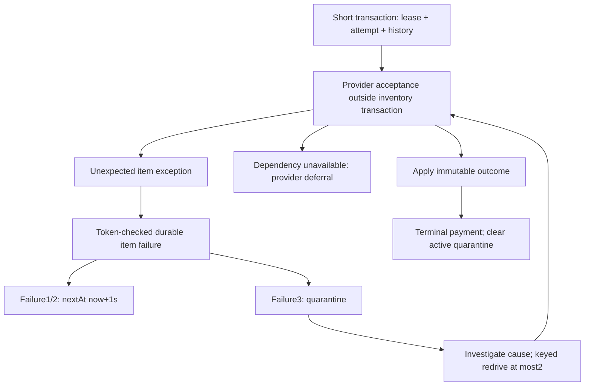

# Scenario 3: one bad payment must not block healthy recovery

> **Running this in this repository (note added 2026-10-08).** This tutorial was
> written and verified in the original `D:/java-projects/ticket-booking-lab`. Its
> commands and diagrams keep that lab's addresses as history. In this standalone
> repository, run from `D:/sd-book-my-show` (Compose project `sd-book-my-show`) and
> substitute: API A 8105→**8130**, API B 8106→**8131**, gateway 8107→**8132**,
> provider 8123→**8133** (container port 8121 unchanged), PostgreSQL 5547→**5553**.
> The full mapping is in [standalone setup](STANDALONE_SETUP.md#separate-local-addresses).
> `git diff 6c2e57a..main` shows the generic code it uses is unchanged; later
> commits added only movie code and resource limits.
> Recommended order: see the [study path](PROJECT_STATUS.md#study-path).

This lesson extends the completed API-failover and provider-isolation studies.
We implement poison-job isolation, persistent quarantine, controlled redrive and
failure classification in the existing PostgreSQL payment worker. No broker is
needed: the payments table already stores durable work. Read
[verification](VERIFICATION.md) for executed evidence, rather than treating the
examples below as a performance guarantee.

## Five interview points and a spoken answer

1. Catch unexpected item-processing exceptions inside each claimed payment's
   boundary. Healthy items later in the batch must still run.
2. Classify shared dependency failures separately. A database outage or provider
   timeout does not establish that a particular payment is malformed.
3. Persist failure count, next-at, quarantine time/reason and history. Restarting
   or switching replicas must not reset the retry policy.
4. Quarantine stops automatic work; it does not establish payment FAILURE.
   Acceptance may already have occurred, so reconciliation remains an obligation.
5. Redrive after investigating the cause, preserve payment identity, bound extra
   attempts, and deduplicate the operator request across replicas.

**A short spoken answer:** “Our payment worker previously let one unexpected
exception interrupt its batch. Now a claimed item's processing boundary records
the exception, defers it, and continues healthy work. Three item failures move it
to persistent quarantine. Dependency outages follow their own policy. Operators
can make at most two keyed redrives using the original payment UUID. If acceptance
already happened, redrive finds that receipt. A late success still requires a
refund and cannot take a seat from its newer owner.”

> **Common misconception.** "Quarantine resolves the payment." A quarantined
> `UNKNOWN` payment is still a liability: the provider may have charged the buyer.
> Quarantine stops it from blocking healthy work. Reconciliation or a keyed redrive
> with the *same* payment UUID is still needed to settle it.

## 1. Understand the actual failure gap

Before this change, `recoverBatch` selected up to 20 payment IDs and called recover
in a loop. ProviderBoundary.Unavailable already had its own catch. An unexpected
runtime exception escaped the loop and skipped later IDs for that tick. The
five-second lease could eventually make the failed item recoverable, but did not
prove continued progress for the skipped healthy items.

Maintenance also wrapped expiry and payment recovery in a single catch. An expiry
error skipped the payment phase. It now gives the two phases independent catches
inside the same lifecycle admission gate. An active drain still prevents new ticks.

The deterministic teaching fixture throws **after provider acceptance commits**.
This is deliberately harder than rejecting a malformed request before acceptance:
there is already a SUCCESS receipt, yet the booking has not been confirmed.
We safely throw a Java exception; we do not kill the JVM, cause OOM or execute a
catastrophic regex. Those process-level failures need additional containment.

**Interview points — isolation boundaries:**

- A catch around the entire batch protects the scheduler but skips remaining work.
- A catch around one claimed item's processing lets later healthy items run.
- Independent maintenance phases prevent expiry failure from skipping recovery.
- Runtime exception handling cannot contain JVM termination, unbounded CPU work
  or a host failure; this lab makes no such guarantee.

## 2. Read the implementation in this order

| Order | File / method | What to establish |
| --- | --- | --- |
| 1 | [V3 migration](../src/main/resources/db/migration/V3__poison_job_isolation.sql) | Additive metadata, bounded counts, durable history and candidate index |
| 2 | [PaymentProcessor](../src/main/java/com/example/booking/PaymentProcessor.java), recoverBatch/recover | Selection, atomic claim, commit before provider work, item/dependency catches |
| 3 | [RecoveryIsolation](../src/main/java/com/example/booking/RecoveryIsolation.java), failed | Token/lease checks, UNKNOWN, one-second deferral and third-failure quarantine |
| 4 | RecoveryIsolation.admitRedrive | Payment row lock, key replay, two-redrive cap and original UUID |
| 5 | PaymentProcessor.apply | Seat → booking → payment locking, terminal outcome and late refund |
| 6 | [Maintenance](../src/main/java/com/example/booking/Maintenance.java) | Independent expiry/recovery catches and lifecycle admission |
| 7 | [controllers](../src/main/java/com/example/booking/PoisonController.java) / [diagnostics](../src/main/java/com/example/booking/RecoveryController.java) | Optional mutation controls versus always-available diagnostics |
| 8 | [integration tests](../src/test/java/com/example/booking/PoisonIsolationIntegrationTest.java) | Real PostgreSQL invariants, races, lease fencing and classification |

Do not rewrite V1/V2: Flyway applies V3 to the retained database. Old payment IDs,
seat constraints, receipt identity and checkout keys remain intact.

## 3. Two independent state machines

Payment outcome is PENDING/UNKNOWN/SUCCESS/FAILURE. Recovery control is active or
quarantined; it is stored in separate columns. A provider dispatch budget is a
third policy (`retryExhausted`), introduced by scenario 2.



`itemFailures` counts caught item failures and saturates at 3. It is historical,
not a claim that the error is mathematically deterministic. The reason is the
exception class, at most 64 characters; arbitrary exception messages or bodies
are not persisted. Counts and reason remain after resolution. The history records
claims, failed processing, quarantine, fixture correction, redrive admission and
outcome application. The history API returns the latest 100 entries, newest first.

Automatic selection excludes quarantine and exhausted provider budgets, orders
by nextAt then UUID, and selects 20. Each item claim independently increments total
`attempts` and gets a new token/5s lease. Selection is not ownership: competing
replicas can select the same ID, but the conditional claim admits only one.

**Interview points — persistence and retry policy:**

- Durable nextAt avoids sleeps while holding database connections.
- A third item failure quarantines; provider budget exhaustion is different.
- Stable ordering and deferral reduce repeated selection of a bad item.
- A failure-record transaction checks token and unexpired lease; stale workers
  cannot record quarantine over another owner's work.

The one-second item delay is a small, deterministic study policy. It does not
replace scenario 2's jittered provider deferral. A fleet-wide programming defect
could fail many items: per-item isolation alone cannot prevent mass quarantine.
Observe aggregate error signatures and stop rollout/dispatch when warranted.

## 4. Classify what failed

| Failure | Action | Why |
| --- | --- | --- |
| Provider unavailable, timeout, invalid receipt, breaker or bulkhead rejection | Existing UNKNOWN/provider deferral and provider budget | Dependency failure is not proof of poison data |
| Spring DataAccessException or TransactionException | Abort current batch; retain claim for lease recovery | Shared DB failure cannot safely persist a classification |
| Other RuntimeException after claim | Persist item failure, continue batch | Conservative bounded containment for an item processing bug |
| Exception during candidate query/claim | Batch-level failure | No successful claim exists to attribute/fence a processing result |
| JVM Error, process kill, OOM | Outside this catch boundary | Another process can recover committed work after lease expiry |

Malformed provider timestamps are explicitly converted to INVALID_RECEIPT rather
than accidentally counted as NumberFormatException poison errors. Every database
error is conservatively kept outside quarantine, including an item-specific SQL
constraint error. That avoids false quarantine during shared outages, but means
some SQL defects still interrupt a batch and require investigation.

**Interview points — failure classification:**

- A timeout tells us the caller stopped waiting, not whether acceptance happened.
- Dependency failure and item failure have separate counters and control states.
- Do not swallow infrastructure failure and pretend a healthy outcome exists.
- Classification has tradeoffs: database exceptions are deliberately conservative
  here; production systems may classify verified deterministic SQL failures further.

## 5. Controlled redrive and ambiguous operator responses

Ordinary reconcile returns 409 PAYMENT_QUARANTINED. Redrive is an explicit gated
control with an Idempotency-Key, validated like existing checkout keys. In the
**same short transaction** as claim, it locks the payment row, checks the key's
durable history, requires quarantine, rejects an active lease and enforces a
lifetime cap of 2 admitted redrives. It records the key and increments the cap.
Only then does the transaction commit and call the provider.

Same payment/key replay returns 200 `replayed:true`, with current diagnostics,
without another dispatch. Different keys racing serialize on the payment lock;
an active lease rejects rather than admitting overlapping work. A redrive does
not reset itemFailures, total attempts, retryStartedAt or retryExhausted. It can
make one forced dispatch beyond the automatic provider budget, within the existing
provider boundary. Until a terminal result applies, the payment stays quarantined.
A provider deferral or another item error therefore cannot silently restart polling.

**Crash boundary:** if the process dies after keyed claim commit, that key is
still admitted and consumes one redrive. Replaying it discovers the current state,
but does not execute another attempt, even after lease expiry. Investigate, wait
for the 5s lease to expire, then use a new deliberate key if a cap slot remains.
After both slots are spent, a verified immutable callback remains a local resolution
path. No reset or unlimited hidden operator retry loop is provided.

**Interview points — redrive:**

- Fix or understand the cause before spending a bounded redrive slot.
- Retain the payment UUID; a new identity could duplicate an accepted charge.
- Deduplicate operator commands in durable storage across replicas.
- Replay discovers current state and admission, not a cached historical response.
- Stopping automatic work does not eliminate the reconciliation obligation.

For local SUCCESS received after expiry, apply keeps EXPIRED plus REFUND_REQUIRED.
It never restores the old booking over a newer holder. Terminal application clears
active quarantine, records OUTCOME_APPLIED and reuses existing callback/audit dedup.
No external refund or real payment occurs.

## 6. Run the retained, deterministic experiment

The provider overlay's historical host 8123 is currently occupied by URL-shortener
API C. Scenario 3 uses the default simulator and requires no additional port.
Do not start compose.provider.yml while that port is owned elsewhere.

```powershell
Set-Location D:/java-projects/ticket-booking-lab
mvn -B -ntp verify
docker compose -f compose.yml -f compose.failover.yml -f compose.poison.yml config --quiet
docker compose -f compose.yml -f compose.failover.yml -f compose.poison.yml build api-a api-b
docker compose -f compose.yml -f compose.failover.yml -f compose.poison.yml up -d --wait
node scripts/learn-poison.mjs
npx --yes newman@6.2.2 run postman/poison.postman_collection.json -e postman/poison.postman_environment.json
```

The poison overlay explicitly disables scheduled maintenance on **both** APIs
so checkout→fixture→tick is deterministic. The manual tick runs the exact recovery
batch, but not expiry; lazy reads/new holds still apply expiry. The controls status
reports maintenanceEnabled=false. Run experiments sequentially. The runtime
harness creates fresh retained fixtures, restarts A, races keyed redrives across
A/B, checks late refund/new owner, exhausts redrives, and briefly pauses/unpauses
only this project's PostgreSQL. Its finally block unpauses DB if necessary.
Evidence is written to target/poison-runtime-evidence.json. Read failed evidence
and diagnostics if interrupted; pending fixtures are not deleted or reset.

Stop without deleting data:

```powershell
docker compose -f compose.yml -f compose.failover.yml -f compose.poison.yml stop
```

To return to scheduled default operation, use base+failover **without** poison:

```powershell
docker compose -f compose.yml -f compose.failover.yml up -d --wait
```

This removes the optional control routes and resumes scheduled work; existing
quarantine remains persisted and will not be automatically dispatched. Do not
switch topology midway through the poison collection.

## 7. Manual API trace and IntelliJ checkpoints

Import [Postman collection](../postman/poison.postman_collection.json) and
[environment](../postman/poison.postman_environment.json). The collection creates
a two-seat event and bad/healthy checkout intents, then enables the bad fixture.
First tick confirms the healthy item and records UNKNOWN/itemFailures1 for bad.
Two subsequent ticks after 1100ms waits reach quarantine with attempts 3. It checks
history and denied ordinary reconcile, fixes the fixture and redrives once.
Same-key replay leaves attempts 4; confirmation audit occurs once.

Relevant calls, substituting the original payment UUID:

```http
POST /api/demo/recovery/payments/{id}/fixture
Content-Type: application/json

{"enabled":true}

POST /api/demo/recovery/tick
GET /api/payments/{id}/recovery
GET /api/payments/{id}/recovery/history
GET /api/recovery/status

POST /api/demo/recovery/payments/{id}/fixture
Content-Type: application/json

{"enabled":false}

POST /api/demo/recovery/payments/{id}/redrive
Idempotency-Key: investigate-then-redrive-1
```

Set IntelliJ breakpoints after claim returns, in afterAcceptance, in failed's
token-checked update, in admitRedrive, and in apply's final confirmation predicate.
Inspect SQL rows from another connection after acceptance: one receipt exists,
payment is unresolved and no inventory lock spans the provider call. Debug pauses
longer than 5s intentionally make the lease stale; the worker then cannot record
its result. Resume through a fresh lease rather than weakening the fence.

## 8. Capacity, ownership, rollout and limits

Let h be average healthy item processing time. One sequential worker's theoretical
healthy completion bound is roughly 1/h; a 20-item batch costs approximately 20h
before overhead. Production scheduling waits 500ms after the prior tick finishes,
so useful rate is below 20/(20h+0.5). Two APIs do not guarantee double capacity:
they can select overlapping IDs and share PostgreSQL. These are equations to
measure against, not measured throughput. Large backlogs and scan contention need
partitioned ownership or a broker/outbox in a separate design.

One bad item costs at most 3 recorded automatic item failures before quarantine,
plus at most 2 admitted redrives. Crashes before failure recording are not bounded
by itemFailures; remote mode retains its separate durable dispatch budget.
Ordering/deferral provides finite healthy progress in the tested batch. There is
no starvation-freedom proof under unbounded arrivals or fixed recovery-lag SLO.

Quarantined UNKNOWN still counts toward scenario 2's100-unresolved/30s-oldest SQL
admission rule. Excluding it would hide real unresolved liability and admit more
work than operators can reconcile. The backlog API separately reports quarantined
count. Expiry frees inventory; it does not resolve payment uncertainty. Test this
interaction in real PostgreSQL before using different operational thresholds.

Booking/payment operations owns quarantine review: inspect reason/history, check
receipt and seat state, correct the cause, choose a keyed redrive, and verify
terminal outcome/refund obligation. Alert candidates include quarantine count,
oldest age, repeated error class across unrelated items and redrive exhaustion.
The current diagnostics are finite SQL observations, not an alerting platform.

Rollout: apply additive V3, validate existing fixtures and old-key replays, then
roll updated workers. An older binary ignores quarantined_at and can reclaim
these rows, so **mixed old/new recovery workers are unsafe** for the quarantine
contract. Drain/stop old worker ticks before enabling quarantine processing.
Do not remove V3 or change migration checksums when rolling back: disable work
and investigate rather than putting older automatic workers on quarantined rows.

**Interview points — operations and scale:**

- Count and age unresolved obligations, including quarantined payments.
- Assign an owner and runbook; a dead-letter table alone does not resolve work.
- Additive schema compatibility does not imply old workers honor new semantics.
- Measure recovery capacity and oldest age; process health is not a recovery SLO.

The same DB stores bookings, recovery controls and the default simulator's
receipts. DB/host failure affects all three; API replication cannot remove that
failure domain. No auth, host/database HA, process-crash containment, external
exactly-once or production SLO is established by this exercise.

## 9. Compare the learning sources and practice

Read the local [archived poison article](D:/AA-SYSTEM-DESIGN-ARCHITECTURE/SDIR-pdf/systemdr-roadmap-sources/172-the-poison-pill-request-how-one-bad.html)
and [original Python source](D:/AA-SYSTEM-DESIGN-ARCHITECTURE/sep-30-2026/sdir-p-main/poison%20pill/poison-pill-demo/app/app.py).
The Python unsafe route sends SIGTERM on recognized payload patterns; counters
and poison patterns are in memory. Its safe route validates inputs. This Java
extension studies a **persisted payment job** and uses durable quarantine and
keyed redrive. It does not port the Python HTTP contract, demonstrate segfault
containment or run its reset/cleanup scripts. The article's proxy retry defaults
and incident figures are source assertions, not evidence about this lab. Our
HAProxy configuration explicitly has zero retries.

Exercises:

1. Explain why a receipt exists when payment is UNKNOWN in quarantine. Locate
   each commit and say what a crash after that commit leaves behind.
2. Keep the fixture broken for two redrives. Explain why a third key rejects
   and why changing the payment UUID would be unsafe.
3. Predict the effect of a 10s debugger pause after claim. Show token/lease fencing
   without changing the configured lease.
4. Compare a provider timeout, a DB outage and PoisonFixtureException. Identify
   which metadata changes and why the outcomes cannot be inferred from the error.
5. Explain why the old worker cannot be safely left running during V3 rollout,
   and design a deliberate drain/upgrade order for a larger fleet.

Stop after scenario 3. Outbox delivery, refund saga, database HA, optimistic seat
versions and a general retry-storm harness remain separate proposals.
