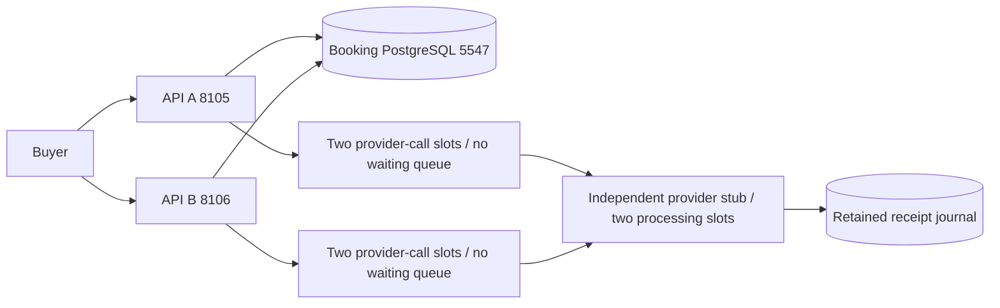
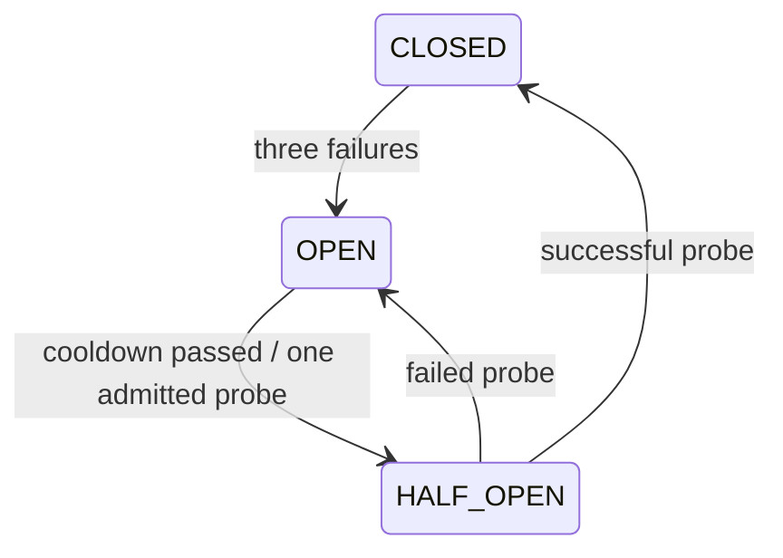

# Scenario 2: a payment-provider outage without exhausting booking capacity

## Five interview points to remember first

1. Commit the payment intent before contacting the provider. Retry with that same
   payment UUID; a lost response cannot tell us whether acceptance occurred.
2. Isolate provider capacity from inventory: short seat transactions, two immediate
   provider-call slots per API, zero application waiting queue, and two processing
   slots in the independent stub across both APIs.
3. Use a 400ms HTTP attempt deadline, a durable automatic dispatch budget of four
   attempts or ten seconds, jittered deferral, and one retry owner. Timeout does
   not cancel remote work or establish payment failure.
4. A breaker stops repeated dependency calls, admits one half-open probe per API,
   and ignores results from older breaker generations. It is not a capacity quota.
5. Preserve UNKNOWN and the reconciliation obligation after retries stop. Measure
   unresolved age/count; pause new checkout at 100 unresolved intents or 30s oldest
   age. Existing keys still replay; late success requires a refund, never seat theft.

**A short spoken answer:** “I commit an idempotent payment intent in a short
inventory transaction, then process it through a separate bounded provider
boundary. Each API allows two simultaneous calls with a 400ms deadline. The
simulated provider also limits actual work, because a caller timeout does not
cancel a remote operation. One durable worker owns retries, with a four-attempt,
ten-second dispatch budget and jitter. A breaker admits one recovery probe.
Ambiguous results remain UNKNOWN. If backlog count or age grows beyond our
operational budget, I pause new checkout while keeping browse, hold and replay
available. Reconciliation uses the same payment identity. Success after expiry
creates a refund obligation and cannot reclaim another buyer’s seat.”

This describes the local implementation, not a production payment guarantee.
Executed results and their limits are in [VERIFICATION](VERIFICATION.md).

## The failure story, step by step

Alice holds seat 1 for 120 seconds. Checkout commits payment P and returns 202.
The provider accepts P and writes its receipt, but takes 1500ms to respond.
The API stops waiting after approximately its 400ms HTTP deadline. It does not
know the outcome yet, so it records UNKNOWN and releases its payment lease.
Meanwhile Bob can browse and hold seat 2. Alice retries checkout with her
original key and payload: it returns P, not a second payment. A later worker
submits P again; the stub returns its immutable receipt. If Alice’s hold is
still valid, the booking confirms. If it expired and Bob now owns seat 1, Alice
gets REFUND_REQUIRED and Bob keeps the seat.

The old simulator wrote receipts directly in the booking database. Stopping
that database stopped inventory too. The optional overlay adds a **separate Java
process** with its own retained file journal. Its fault modes do not stop booking
PostgreSQL. The original local simulator remains the default when PROVIDER_URL
is empty. Keep the provider overlay enabled throughout a scenario 2 exercise;
switching simulators is a lab topology change, not a production migration protocol.



Host provider port is **8123**; container port is 8121. Ports 8121 and 8122 were
already owned by another project’s coordinators and were preserved. Optional
HAProxy remains on 8107. All published ports are loopback fixtures.

## Read the code in this order

| Order | Source | Question to answer |
| --- | --- | --- |
| 1 | [V1 schema](../src/main/resources/db/migration/V1__booking.sql) and [V2 migration](../src/main/resources/db/migration/V2__provider_retry_budget.sql) | Which identity, uniqueness, lease and retry fields survive restart? |
| 2 | [BookingService](../src/main/java/com/example/booking/BookingService.java), checkout | Why is replay checked before new-intent admission? |
| 3 | [PaymentProcessor](../src/main/java/com/example/booking/PaymentProcessor.java), recover/recoverBatch/defer | Where does claim commit, and where is retry scheduled? |
| 4 | [ProviderBoundary](../src/main/java/com/example/booking/ProviderBoundary.java) | Which operations consume a slot and count a breaker failure? |
| 5 | [LocalProvider](../src/main/java/com/example/booking/LocalProvider.java) | How does a remote receipt become an immutable booking-side observation? |
| 6 | [ProviderStub](../infra/ProviderStub.java) | Why can actual remote work continue after timeout without growing without bound? |
| 7 | PaymentProcessor.apply and BookingStore | Why must success still lock seat then booking then payment and test SQL-clock expiry? |
| 8 | [Integration tests](../src/test/java/com/example/booking/ProviderIsolationIntegrationTest.java) and [runtime harness](../scripts/learn-provider.mjs) | Which assertions prove a mechanism, and which are only observations? |

Java records hold values; JdbcTemplate makes SQL visible; store.tx owns the
database transaction. Constructor injection makes the provider boundary explicit.
Do not read a successful HTTP status as proof of the booking’s final state.

## Trace the transaction boundaries

```mermaid
sequenceDiagram
  participant Buyer
  participant API
  participant DB as Booking database
  participant Provider as Independent stub
  Buyer->>API: checkout booking/key/payload
  API->>DB: seat then booking lock; replay or admission; insert P
  DB-->>API: commit CHECKOUT + PENDING
  API-->>Buyer: 202 durable intent
  API->>DB: claim P with token/5s lease; increment dispatch attempts
  DB-->>API: commit claim
  API->>Provider: POST P / immutable outcome and available time
  Provider->>Provider: append receipt and force journal
  Note over API,Provider: Provider may continue after the 400ms caller deadline
  API->>DB: token-checked UNKNOWN + nextAt + budget status; commit
  Note over API,DB: No inventory connection or lock spans provider HTTP
  API->>Provider: later retry same P
  Provider-->>API: existing receipt
  API->>DB: separately commit local receipt observation
  API->>DB: seat then booking then payment; validate token, receipt, expiry
  DB-->>API: CONFIRMED or late-success refund obligation
```

The local observation uses the existing provider_receipts table. It is written
only after a valid stub response, in a separate transaction. In LOSS mode the
remote receipt can exist while the local observation does not. The next same-P
submission discovers it. Callback/apply reads the local receipt before entering
inventory locks; it performs no network request. An early callback without a
local observation can return NOT_FOUND; reconcile the payment first. This is a
local teaching callback, not a signed production provider callback.

The token and five-second lease still fence worker application. A dead API can
leave a durable claim; another API resumes after lease expiry. A terminal payment
prevents a stale worker from repeating confirmation. Client deadlines, lease
expiry, receipt availability and hold expiry are different clocks/budgets.

## 1. Bulkheads: deciding how much work may enter

**Three interview points:**

1. A semaphore limits concurrent dependency calls; reject immediately instead of
   building a hidden queue behind servlet requests.
2. Per-process limits multiply with replicas. A separate provider processing cap
   bounds work that survives client cancellation.
3. Protect transaction boundaries too: a two-slot HTTP limit is useless if slow
   calls hold inventory connections or locks.

ProviderBoundary.tryAcquire gives each API two permits. On overload, it throws
BULKHEAD_FULL immediately. The payment worker records a durable nextAt and UNKNOWN;
it does not sleep while holding a database connection. The permit remains held
until synchronous HttpClient.send returns or throws, then finally releases it.
There is no Future timeout that abandons a still-running local task.

Two APIs permit at most four client calls together. The stub uses its own
two-permit semaphore **before payment processing**, held until its handler really
finishes. This is the shared cap for this one stub process, including calls from
both APIs. Replicating the stub would multiply that cap. It is not a distributed
quota across independent providers.

The stub has eight dispatch threads, a bounded executor queue of 32 and a listen
backlog of 32. Those are transport/handler limits, distinct from its two payment
processing slots. It returns 503 when processing slots are full; saturated
dispatch may drop a connection. Control/stats are fast handlers but do not have a
dedicated management executor. This finite exercise is not proof of management
availability under hostile transport saturation.

**Capacity example:** two processing slots at 1500ms per operation imply at most
roughly 2/1.5 = 1.33 operations/s before overhead in SLOW mode. That includes
duplicate lookups/submissions, not only newly accepted payments. Increasing API
replicas cannot increase this bottleneck. At 3 new intents/s and 1.33 resolutions/s,
backlog could grow about 1.67/s; retries can make it worse. These are explanatory
assumptions, not measured throughput or an SLO.

## 2. Deadlines: how long to wait, and what timeout means

**Four interview points:**

1. Use a 200ms connect timeout and a 400ms per-request HTTP deadline; include
   connection setup in the attempt budget rather than adding another retry layer.
2. Timeout means uncertain observation. It does not prove remote work stopped.
3. Bound actual remote concurrency and processing time independently.
4. The durable ten-second budget stops automatic dispatch; it is not a promise
   that the end-to-end business outcome resolves within ten seconds.

SLOW and LOSS hold a stub processing slot for a finite 1500ms after acceptance.
The test checks active remote work after caller timeouts, while the client’s
permits have been released. The provider’s two-slot cap, rather than an assumption
about cancellation, keeps that surviving work bounded.

The dispatch clock begins at the first claim, not at checkout creation. Automatic
claims require attempts < 4 and retryStartedAt newer than SQL now minus ten seconds.
A claim begun just before ten seconds can finish its 400ms request afterwards.
Database claim/application latency and lease recovery are outside that HTTP
deadline. Scheduling uses the database clock; the breaker uses monotonic JVM time.
No hard real-time scheduling guarantee is claimed.

The [Java 21 request-timeout API](https://docs.oracle.com/en/java/javase/21/docs/api/java.net.http/java/net/http/HttpRequest.Builder.html#timeout(java.time.Duration))
documents HttpTimeoutException for an overdue response. Our faults delay before
response headers and return one tiny receipt body. A provider that streams headers
then stalls its body needs separately verified body-consumption deadlines; this
lab does not establish a hard whole-body deadline against an arbitrary server.
The [HttpClient API](https://docs.oracle.com/en/java/javase/21/docs/api/java.net.http/java/net/http/HttpClient.html)
also cautions that cancellation cannot establish when a request stops remotely.

The simulator’s readyAt/delayMs is a **business outcome availability time**, not
the new HTTP sleep. delayMs=10000 can exceed the automatic recovery budget. That
intentionally leaves reconciliation for an operator after availability; never
translate budget exhaustion into FAILURE. Hold TTLs can be only two seconds, so
even a bounded 400ms attempt is not a promise that a short hold can be confirmed.

## 3. Circuit breaker: stop calling a dependency that keeps failing

**Four interview points:**

1. CLOSED allows bounded calls; three consecutive observed dependency failures
   open this process’s breaker for two seconds.
2. OPEN rejects without HTTP. After its cooldown, one call becomes HALF_OPEN;
   other callers defer while that probe is in flight.
3. Probe success closes, probe failure reopens. Results from an older generation
   cannot close a newer OPEN state.
4. Provider outages should not remove all useful booking APIs from readiness.



enter and finish synchronize the state machine. A generation is captured at
admission. Opening/closing advances the generation; a late success from an older
batch releases its slot but cannot reset the newer breaker. Local bulkhead/open
rejections do not count as dependency failures. A valid HTTP receipt is transport
success even if the business outcome is FAILURE or not yet ready.

The breaker is local to each API and resets on restart. The persisted payment
attempt budget does not reset. Two APIs can each admit a half-open probe; the
stub’s independent shared processing cap remains two. One-probe recovery is a
simple lab policy, not a statistically robust recovery detector.

Readiness still includes booking DB health, not provider health. An OPEN provider
breaker does not make browse and hold unusable. HAProxy retries remain disabled.

## 4. Retry ownership, amplification and durable deferral

**Four interview points:**

1. PaymentProcessor owns automatic retry; checkout, proxy and provider boundary
   have no application retry loop.
2. Reuse the payment UUID and immutable outcome/availability payload. Request
   identity is separate from a worker’s lease token.
3. Store attempts, first-dispatch time, nextAt, lastError and exhausted status in
   PostgreSQL. Backoff survives restart and coordinates both APIs.
4. Exhausted payments remain unresolved and visible; deliberate operator
   reconciliation can make one extra attempt without resetting the auto budget.

defer uses capped exponential windows: attempt 1 up to 500ms, attempt 2 up to
1000ms, later attempts up to 2000ms, each randomized between 100ms and its cap.
This is bounded jitter, not a promise of uniform fleet timing. The 500ms maintenance
poll adds scheduling delay. Two replicas can inspect a candidate, but only one
conditional SQL lease claim owns it. attempts counts claimed dispatches, including
ones rejected locally by breaker/bulkhead; it bounds application send invocations, not
an exact count of provider requests. Provider stats counts admitted processing.

After four dispatches or ten elapsed seconds, automatic claims stop. Batch polling
materializes retryExhausted for aged/budgeted inactive leases. A crash can leave
an active five-second lease before that status becomes visible. recover(force=true),
used by the explicitly named demo reconcile API, bypasses nextAt and the automatic
budget, respects active leases, and makes at most one bounded provider call. It
does not clear retryExhausted or retryStartedAt. Terminal state excludes the row
from future work. Operators must not automate unbounded calls to this escape hatch.

Layered retries multiply: three client attempts × three proxy attempts × four
worker attempts could create 36 transmissions. Here checkout only commits/replays
an intent, HAProxy has no retry, and the boundary calls once. Durable workers
defer instead of recursively retrying. Provider failures are handled per payment;
unexpected programming/DB errors can still interrupt the batch. Poison-job
classification, quarantine and redrive remain scenario 3, not this delivery.

## 5. Graceful degradation and reconciliation policy

**Four interview points:**

1. UNKNOWN means “outcome unresolved”, not “declined”. Browse and hold can remain
   useful while payment resolution is delayed.
2. Stop new checkout if count is already 100 or oldest unresolved age is at least
   30 seconds; enforce the shared decision in the booking database.
3. Replay an existing checkout before applying admission policy. Discovery must
   work during the outage that created uncertainty.
4. A payment incident needs an operational owner, backlog age/count, deliberate
   reconciliation and late-success refund handling.

New remote-mode checkout takes a PostgreSQL transaction advisory lock shared by
both APIs before checking the backlog and inserting a new intent. This prevents
concurrent checkouts from overshooting the count cap. It occurs after the booking
lock, and the query does not lock unrelated bookings. It adds one shared admission
serialization point; this small lab intentionally favors an understandable cap
over admission throughput. Hold paths do not take that global lock.

The oldest-age check is an operational budget, not an adaptive per-booking TTL
estimate. It includes expired/cancelled UNKNOWN payments and exhausted rows:
they still represent unresolved acceptance. Admission reopens when operators or
workers reduce the backlog within count/age bounds. With a two-second hold, late
success is entirely possible even below the 30s admission threshold. Production
policy could reject checkout when remaining hold life is insufficient, add a
waiting room, or negotiate a different inventory/payment protocol.

GET /api/provider/status exposes local boundary counters, shared unresolved count,
exhausted count and oldestSeconds. These queries are advisory snapshots, not a
single atomic view of all state. GET /api/payments/{id}/recovery exposes persisted
dispatch metadata. lastError is the last deferral reason and can remain after
success; it is not the terminal result. Stub stats exposes actual active/maximum
processing and receipt count. Its counters reset on restart; its receipts persist.

Operationally, separate booking ownership from provider dependency response.
The booking on-call investigates age/leases and admission; the provider integration
owner investigates acceptance using the stable payment ID; financial operations
would own real refunds. This lab only records REFUND_REQUIRED and simulated refund
acknowledgment. Define production alerts on oldest unresolved age, exhausted count,
admission rejection and drain rate; no production thresholds or SLO are measured here.

## Run the finite experiments

From this project directory, with Docker available:

```powershell
mvn -B -ntp verify
docker compose -f compose.yml -f compose.failover.yml -f compose.provider.yml config --quiet
docker compose -f compose.yml -f compose.failover.yml -f compose.provider.yml build api-a api-b provider
docker compose -f compose.yml -f compose.failover.yml -f compose.provider.yml up -d --wait
node scripts/learn-provider.mjs
npx --yes newman@6.2.2 run postman/provider.postman_collection.json -e postman/provider.postman_environment.json --delay-request 500
```

The harness creates retained fresh fixtures and sequentially exercises SLOW,
UNAVAILABLE, LOSS, recovery, expiry/reassignment and a provider process restart.
Its finally block restores NORMAL mode. Evidence is
target/provider-runtime-evidence.json; it records age/count and attempt observations.
Do not run another collection or fault harness concurrently; controls are shared.
An interrupted collection may leave a fault mode enabled. Restore it manually:

```powershell
Invoke-WebRequest -Method Post http://localhost:8123/control?NORMAL
Invoke-RestMethod http://localhost:8105/api/provider/status
Invoke-RestMethod http://localhost:8123/stats
```

| Experiment | Expected observation | What it proves |
| --- | --- | --- |
| SLOW | Remote active remains positive after callers time out; browse/hold succeed | Timeout does not cancel work; separate bounded capacity works for this workload |
| UNAVAILABLE | UNKNOWN, at most four automatic dispatches; later polling does not reset attempts | Durable budget limits retry work |
| LOSS | Journal contains old payment UUID despite no response | Acceptance and observation are separate commits |
| Recovery | Original payment UUID reaches SUCCESS | Same-ID discovery, not new-payment retry |
| Expiry/reassignment | Old REFUND_REQUIRED, replacement remains HELD | No seat theft during reconciliation |
| Stub restart | Receipt count retained; counters restart | Independent process restart recovery with retained local storage |

The integration test also holds two slow HTTP operations, rejects a third call,
tests one half-open probe, stale-generation completion, age-based admission and
same-key replay during admission closure using real PostgreSQL. The actual stub’s
two-slot behavior is verified separately by the Docker harness.

## IntelliJ walkthrough and debugging checkpoints

Import the existing Maven project and use Java 21. For a host API, set
PROVIDER_URL=http://localhost:8123 and use a free PORT; the containers use
http://provider:8121. Do not start a host API on the running A/B ports.

1. Break in BookingService.checkout after the existing-payment branch. On replay,
   explain why it never evaluates new-intent admission or allocates another UUID.
2. Break just after recover’s claim transaction. In another DB session inspect
   lease_token, lease_until and attempts. Inventory locks should be gone.
3. Break in ProviderBoundary.enter. Predict CLOSED versus OPEN versus HALF_OPEN;
   inspect available permits and generation before admission.
4. Use SLOW without stepping through the actual timeout. Watch stub stats and
   UNKNOWN state; compare client inFlight with remote active.
5. Break in defer. Inspect nextAt and retryExhausted after transaction commit.
6. Break in apply before the final confirmation UPDATE. Expire/reassign the old
   booking in a separate finite test and observe the refund branch.

Pausing all JVM threads distorts deadlines, five-second leases and expiry.
Use suspend-thread for narrow inspection or run assertions without a debugger.
If you pause beyond the lease, a stale token is expected to lose application rights.

## Failure domains, rollout and what remains unverified

The stub is a separate process/storage dependency, but shares the Docker host,
network and physical disk with the APIs/database. This demonstrates independent
provider-process faults, not host/zone HA. Booking PostgreSQL remains a single
primary. The stub journal forces each append before accepting; controlled restart
retention is tested. Torn writes, storage corruption, disk-full recovery and host
crash durability are not established. It is not a financial ledger.

Rollout order: add V2 without rewriting V1; validate/build the stub; start it;
enable PROVIDER_URL on one API, inspect admission/backlog, then the other. The
executed local rollout rebuilt both APIs with retained data. Production mixed-mode
migration is not verified: local and remote simulators are different authorities.
Retain both volumes and observe old unresolved intents. Disable admission or drain
before changing a real provider authority; never invent a new payment identity to
avoid uncertainty. Do not roll back schema by deleting columns or volumes.

Stop this lab with the same three Compose files and `stop`; resume with
`up -d --wait`. Keep provider-data and booking-data. Base-only `up` returns APIs
to the original simulator; use all overlays to continue scenario 2.

There are no real sends, payments, credentials, production auth, signed callbacks,
exactly-once external effects, fleet quota, throughput benchmark or production SLO.
Provider receipt deduplication is the stub’s local contract, not a claim about an
arbitrary external provider. The finite recovery duration is evidence for this
experiment only. Tutorial delivery and assistant test results do not establish
learner mastery.

## Sources and comparison

Read the archived articles first: [timeouts/retries/breakers](D:/AA-SYSTEM-DESIGN-ARCHITECTURE/SDIR-pdf/systemdr-roadmap-sources/024-designing-for-failure-mastering-timeouts.html),
[bulkheads](D:/AA-SYSTEM-DESIGN-ARCHITECTURE/SDIR-pdf/systemdr-roadmap-sources/078-bulkheads-and-isolation-in-system.html)
and [retry storms](D:/AA-SYSTEM-DESIGN-ARCHITECTURE/SDIR-pdf/systemdr-roadmap-sources/126-retry-storms-prevention-and-mitigation.html).
Their source-canonical-url metadata identifies the original article; these are
teaching designs, not evidence that our Java implementation has their guarantees.

The original [JavaScript breaker](D:/AA-SYSTEM-DESIGN-ARCHITECTURE/sep-30-2026/sdir-p-main/Graceful_Service_Degradation/graceful-degradation-demo/src/circuit-breaker.js)
uses Promise.race between an operation and a timer. The timer rejects the caller
but does not cancel the operation. Its HALF_OPEN state does not reserve a bounded
probe. Our Java boundary adds immediate slots, one-probe admission and generation
fencing; the separate stub makes surviving remote work observable. The original
demo was inspected, not executed, and there is no original ticket API parity claim.

## Exercises: predict, inspect, explain

1. Predict how four API replicas change client concurrency and whether the one
   stub can process more than two operations. Answer: client permits become eight;
   stub processing remains two, with more possible immediate rejections.
2. Explain why an exhausted UNKNOWN intent can still block admission after its
   seat expires. Answer: inventory expiry does not resolve possible acceptance.
3. Run SLOW, then inspect client and stub counts. Explain why different counts do
   not imply a bug: caller waiting and remote processing have different lifetimes.
4. Read the late-success test and explain which SQL condition protects the new
   owner. Answer: confirmation targets the old booking and requires a valid active
   state/deadline after locks; it never assigns the replacement booking’s seat.
5. Sketch a production admission policy using remaining hold life and provider
   latency distributions. Keep it a proposal; do not change this lab or begin
   scenario 3 as part of this exercise.

Next delivery is scenario 3, poison-job isolation, in a separate session. See
[the handover](NEXT_SESSION_HANDOVER.md). Stop after this scenario 2 kit.
