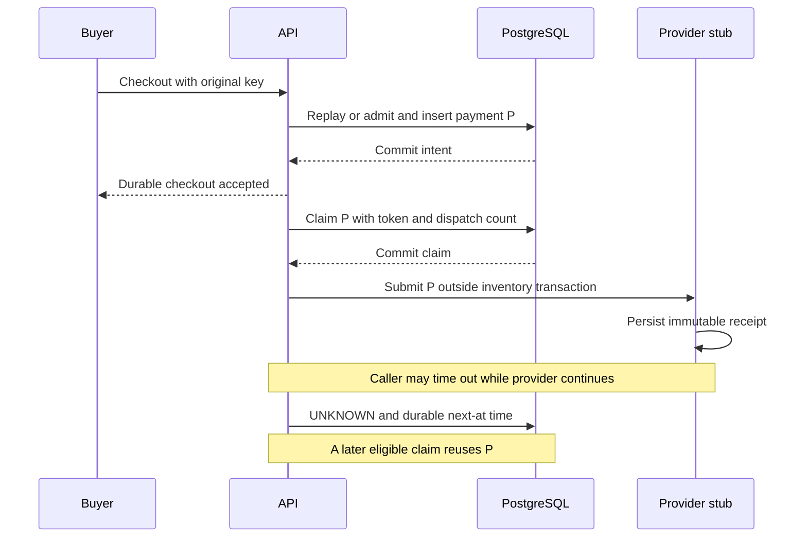

# Study scenario 2: keep a provider incident from exhausting booking capacity

Study session, 2026-10-06. Read this first, then the
[detailed provider tutorial](PROVIDER_ISOLATION_TUTORIAL.md) for each mechanism's
interview points and historical experiments. This lesson inspects existing code;
it does not change services, enable faults, run load or build the hold-retry harness.

The scenario applies to the **generic ticket endpoints in optional remote-provider
mode**, not V5 movie payments. Blank PROVIDER_URL selects the original local
simulator; enabling the movie mock does not enable these provider protections.
Standalone addresses are A8130/B8131/gateway8132/provider8133/PostgreSQL5553.
The original tutorial/evidence retains the original lab's addresses and dates.

## Start with one question

Alice holds a seat. The provider accepts her payment but the response arrives too
late. Should the application send new payments until one response succeeds?

No. It should retain one durable payment identity, make bounded attempts to learn
its outcome, and preserve capacity for other work. If it cannot learn the outcome
automatically, it must keep that uncertainty visible for reconciliation.

Keep three identities distinct:

| Identity | What it identifies | What changes on retry? |
| --- | --- | --- |
| Checkout Idempotency-Key | Buyer's immutable checkout request for this booking | Reuse the same key and payload |
| Payment UUID | Durable payment intent and provider receipt | Reuse the same UUID |
| Lease token | One worker's temporary claim to process the intent | Each new claim gets a new token |

Changing a key after a lost response does not discover the earlier outcome.
The generic domain allows one checkout intent per booking and rejects a different
key/payload for an existing intent. Movie fresh-payment semantics are a separate
contract; do not transfer them to this generic scenario.

## Follow Alice's request through four boundaries

Read [BookingService.checkout](../src/main/java/com/example/booking/BookingService.java)
before reading networking code.

1. Lock the seat, booking and any existing payment. If the checkout already
   exists with the same key/input, return it. Replay comes before new-payment
   backlog admission, but still consumes database work.
2. For a new remote-mode checkout, acquire the shared admission advisory lock.
   Check the unresolved count/age, validate the still-live hold, insert the payment
   and commit CHECKOUT. The HTTP response describes a durable intent, not a charge
   known to have succeeded. No provider HTTP call occurs in this transaction.
3. [PaymentProcessor.recover](../src/main/java/com/example/booking/PaymentProcessor.java)
   conditionally claims that intent with a five-second lease, increments its
   dispatch count, and commits. Only then does LocalProvider call the provider.
4. After a valid response, [LocalProvider](../src/main/java/com/example/booking/LocalProvider.java)
   commits a local receipt observation separately. Final application locks seat,
   booking and payment, verifies the current token/unexpired lease and receipt,
   then tests database-time hold validity before confirmation.

If Alice's hold has expired before success can be applied, confirmation fails and
the booking records REFUND_REQUIRED. Reconciliation does not grant permission to
take another buyer's seat. There is no real charge or external exactly-once claim.

**Pause point:** where must the database transaction end before the network call?
After the worker claim commits. Otherwise slow HTTP consumes inventory connections
and locks for its entire duration.

## Study the five protections in this order

| Protection | Actual setting | What it limits | What it does not establish |
| --- | --- | --- | --- |
| Bulkhead and deadline | Two HTTP slots/API; no application wait queue; 200ms connect timeout and 400ms request deadline | Local calls in flight and caller wait | Remote cancellation or global two-call capacity |
| Provider processing bound | Two slots in the independent stub, including work after caller timeout | Actual work in that one stub process | A quota across multiple provider processes |
| Backoff and durable budget | Jittered deferral; four automatic claimed dispatches or ten seconds from first claim | Timing and lifetime automatic dispatch | Guaranteed business resolution in ten seconds |
| Circuit breaker | Three observed call failures; two-second cooldown; one half-open probe/API | Calls to a failing dependency | A durable or fleet-wide breaker |
| Backlog admission | Reject fresh checkout at100 unresolved or30s oldest age | Growth of new payment liabilities | A rate limit on holds, browse or replay |

### 1. Slots and deadlines: don't build a hidden waiting queue

Open [ProviderBoundary.enter/call/finally](../src/main/java/com/example/booking/ProviderBoundary.java).
The semaphore uses tryAcquire: if no slot is available, reject immediately.
The finally block releases a slot when synchronous HttpClient.send returns or
throws. A caller deadline can release local capacity while remote work continues.

Two APIs allow up to four simultaneous local calls. The
[stub](../infra/ProviderStub.java) has its own two processing slots, held through
the actual handler's completion. Its SLOW/LOSS fixture sleeps1500ms after accepting
the receipt. Without the remote cap, repeating400ms timeouts could leave increasing
numbers of operations alive remotely. These are distinct limits.

The stub also bounds handler threads/queue. “Zero application waiting queue”
describes the API's provider-call gate, not every queue in the HTTP/database stack.
The400ms setting is not evidence of a hard whole-body deadline for an arbitrary
streaming provider; this fixture delays a tiny response before headers.

### 2. Backoff: store a future eligibility time instead of sleeping

Open PaymentProcessor.defer and [V2 fields](../src/main/resources/db/migration/V2__provider_retry_budget.sql).

| Claimed dispatch that needs deferral | Random delay range |
| --- | --- |
| 1 |100-500ms |
| 2 |100-1000ms |
| 3 and later |100-2000ms |

The code draws a delay, saves next_at/last_error/state UNKNOWN and clears the
claim token. It does not sleep while holding a database connection. The maintenance
loop inspects eligible work with500ms fixed delay after a tick completes; work
duration and contention add delay. Backoff is not an exact execution schedule.

The worker owns provider retries. Checkout only inserts/replays intent, the
provider boundary sends once per call, and HAProxy retries remain disabled.
Random timing reduces synchronized bursts; it does not bound the number of retries
or protect unrelated hold traffic by itself.

### 3. Dispatch budget: four dispatches is not four additional retries

Read the conditional claim UPDATE in PaymentProcessor.recover. It increments
attempts before the provider boundary is entered. An open breaker or full local
bulkhead can therefore consume a dispatch without transmitting HTTP.

Automatic claims require attempts below4 and first-dispatch age below10s. The
first claim starts the clock, not checkout creation. Waiting before the first
claim is outside that ten-second window. A claim begun near the boundary can
finish later. An already active lease must also expire before another claim.

Attempts, first-dispatch time and exhaustion persist in SQL. Restarting an API
does not reset that budget. Exhaustion leaves PENDING/UNKNOWN unresolved, rather
than inventing FAILURE. recoverBatch materializes exhaustion for due inactive
claims. The deliberate demo reconcile path can make one additional bounded claim
without resetting the automatic budget; it is not an unlimited retry loop to run.
Later scenario3 quarantine adds separate controlled-redrive rules.

### 4. Breaker: test recovery with a bounded probe

Read ProviderBoundary.enter/finish together. Three consecutive observed call
failures open the local breaker. After two seconds, the first admitted call is
a half-open probe. Other calls are rejected while the probe is active. Success
closes the breaker; failure opens it again.

The generation number prevents a slow result from an older CLOSED batch from
closing a newer OPEN breaker. Local breaker/bulkhead rejections happen before
HTTP and do not count as new dependency-call failures. HTTP success and business
payment success are different: a valid FAILURE receipt is successful transport.
Receipt payload validation occurs in LocalProvider after the boundary returns;
do not assume every invalid receipt is counted as a breaker failure.

The breaker is JVM-local and resets on restart; the dispatch budget is durable.
Two APIs can each issue a recovery probe. That is why the stub's processing bound
remains useful independently of breaker state.

### 5. Backlog: stop accepting fresh liabilities before queues grow indefinitely

Read BookingService.providerAdmission and the checkout advisory lock. Both APIs
serialize new remote checkout admission through the same PostgreSQL lock, then
check PENDING/UNKNOWN count and oldest creation time before inserting.

At99 unresolved payments, an otherwise valid new checkout can create number100.
The next new checkout is rejected. Even one unresolved payment aged31 seconds
blocks new checkout. Expired/cancelled/exhausted UNKNOWN still counts: its payment
outcome remains a liability. The diagnostic queries are advisory observations;
the locked admission decision is what enforces the count boundary.

This global gate is deliberately simple and adds shared serialization. It is
not a per-seat admission mechanism. Existing-key checkout replay remains discoverable
through the application before this gate; replay can still be rejected by database
or lifecycle failure and still consumes capacity. Holds do not acquire this global
admission lock, so “provider outage isolation” does not mean “hold storm protection.”

## Predict the outcomes before reading the answers

| Question | Answer |
| --- | --- |
| Provider persisted a receipt but caller timed out. Is payment failed? | No; UNKNOWN preserves uncertainty. Reuse payment UUID |
| Two local calls already use API A's slots. Should a third wait? | No; boundary rejects and worker durably defers |
| Breaker rejects dispatch4 before HTTP. Did we necessarily send four requests? | No; attempts counts claimed dispatches |
| API restarts after budget exhaustion. Can automatic work start over? | No; persisted budget remains exhausted |
| Backlog is100 and Alice repeats her original checkout key. New payment? | No; replay finds her existing intent before new admission |
| Oldest payment is31s old but count is1. Can fresh checkout enter? | No; age alone closes admission |
| Alice's late success arrives after Bob acquired her expired seat. Who owns it? | Bob; Alice needs refund reconciliation |
| Generic provider mode is enabled. Are movie calls now protected identically? | No; V5 has its own mock/worker contract |

## Evidence reading, without starting an experiment

Read [ProviderIsolationIntegrationTest](../src/test/java/com/example/booking/ProviderIsolationIntegrationTest.java):

- slowAmbiguousAcceptanceKeepsDbFreeAndRecoversWithStableIdentity: another hold
  succeeds during slow calls; provider work survives timeout; same IDs recover.
- automaticBudgetIsDurableAndReplayBypassesBacklogAdmission: stored count/time
  budgets stop automatic calls; aged backlog blocks fresh checkout but permits replay.
- breakerRejectsOpenCallsAndAdmitsOneRecoveryProbe: rejection does not send HTTP;
  a concurrent caller cannot join a running probe.
- staleSuccessCannotCloseAnOpenGeneration: old success releases its slot but
  does not close a newer breaker state.

The test HTTP server is not the full bounded standalone stub. Read the actual
[runtime harness](../scripts/learn-provider.mjs) and
[historical verification/evidence](VERIFICATION.md) for independent stub behavior,
receipt journal restart and A/B scenarios. Source scenario2 verification on
2026-10-04 records29 tests and22 runtime checks; those are historical results,
not tests rerun in this lesson and not100K capacity evidence.

## Carry these lessons into the future hold comparison

Idempotency answers “which operation is this?” Admission answers “how much work
can enter?” Backoff answers “when should the next eligible attempt happen?”
A budget answers “when should automatic attempts stop?” A breaker answers
“should this process call an unhealthy dependency right now?” None substitutes
for seat ownership checks or the unresolved-outcome reconciliation path.

For generic `/api/holds`, a timeout should replay the original buyer/key/payload;
a seat-unavailable409 should prompt a new seat choice, not automatic retries of
the same unavailable seat. Replays still lock/query SQL. The provider's four/10s
policy is not an existing caller policy on this endpoint.

The next separately selected implementation will compare finite immediate retries
and finite jittered retries with the same arrival schedule, transmission budget,
deadline and payloads. Keep server-admission changes in a separate comparison.
Abhishek runs actual services; Ankita generates business load over Tailscale.
No ingress or generator is configured by this study. See the
[saved hot-show plan](HOT_SHOW_AVAILABILITY_AND_RETRY_PLAN.md) for that future work.

## Five interview points

1. Commit intent and claim before HTTP; no inventory transaction spans provider delay.
2. Stable payment identity handles ambiguous response loss; timeout is not decline.
3. Bound local and actual remote work separately; per-API limits multiply with replicas.
4. One retry owner persists eligibility and budget; breaker recovery stays bounded.
5. Pause new checkout on unresolved count/age, preserve discovery, and reconcile late success safely.

Exercise: trace one LOSS-mode payment on paper through checkout, claim, timeout,
durable deferral, recovery and expired-hold application. Label the payment UUID,
changing claim tokens and which transactions have committed. Then explain why
this trace does not prove protection from100K callers repeatedly hitting holds.
