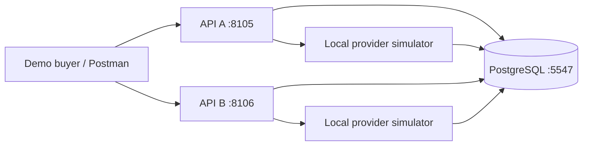
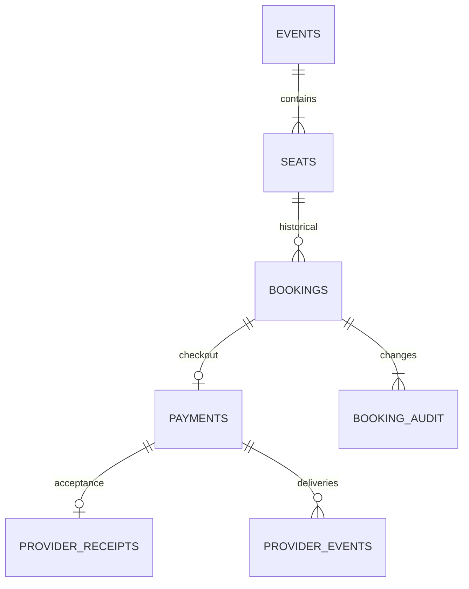
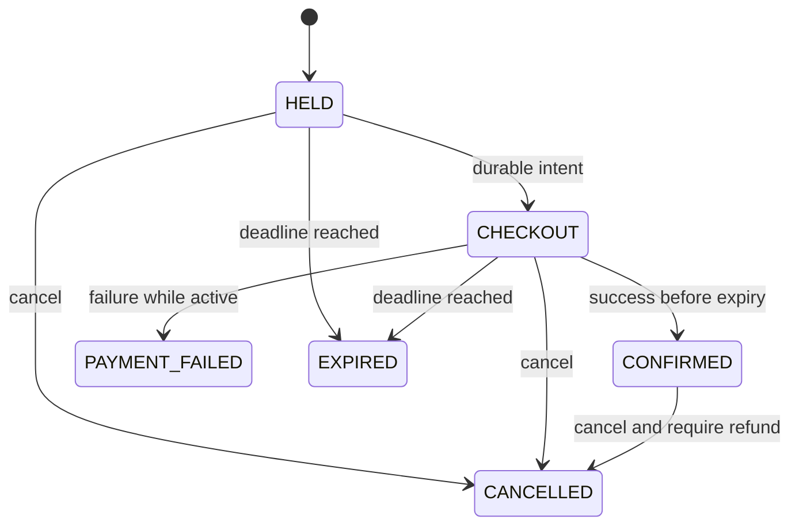

# System specification

## Problem and bounded requirements

Many buyers want the same seat. A successful reservation response must have a durable
owner, while a payment response may arrive after the seat is available to somebody
else. Serve event metadata/seat availability, create temporary holds, accept one
checkout intent per booking, confirm through provider success, cancel, expire,
retrieve state/audit and expose reconciliation. One numbered seat per booking;
multiple independent events use the same model, 1..200 seats each. Group bookings,
seat maps, real authentication, dynamic pricing, fees and real payments are excluded.

Each seat costs 5000 minor units (INR 50.00), fixed in event metadata. Checkout has
no caller-supplied amount and no card field. This is an inventory/concurrency lesson,
not a financial ledger. Demo identities are labels; knowing a booking UUID permits
access and cancellation in this local API.

## Architecture and schema

Both replicas run the same executable and a bounded maintenance loop. The provider
simulator stores receipts in the same local PostgreSQL instance but commits them
separately from inventory. This exposes the acceptance/application gap; it does
not simulate an independently available provider or a distributed transaction.

The [migration](../src/main/resources/db/migration/V1__booking.sql) provides seat
composite primary/foreign keys, unique buyer/hold-key pairs, unique payment booking
IDs, a partial unique active-seat index, valid-state checks and immutable receipt
identity. Constraints establish cardinality; application transitions establish
permitted lifecycle behavior. Direct administrative SQL can still violate business
semantics and is outside the API guarantee.

## Invariants and clock

1. A seat has at most one physical booking in HELD, CHECKOUT or CONFIRMED. HELD and
   CHECKOUT are logically valid only while `expires_at > PostgreSQL clock_timestamp()`.
2. Every inventory mutation locks the seat row before the booking row, then the
   payment row if needed. READ COMMITTED plus this common locking order serializes
   competing decisions; the partial unique index is an independent no-oversell backstop.
3. Confirmation requires provider SUCCESS, the booking's own payment and a conditional
   SQL transition with expiry checked after obtaining locks. Expiry is inclusive at
   equality. The confirmation decision linearizes at this update, not at HTTP receipt
   or commit time. A confirmed booking no longer expires as a hold.
4. A hold key is scoped to buyer ID and permanently binds event, seat and TTL to one
   booking. Same key/input returns the current state of that booking, never a new hold.
   Changed input conflicts. Checkout permits one durable intent per booking and requires
   its original key/scenario/delay on retries, even after cancellation or expiry.
5. Provider outcome is immutable. Duplicate event IDs bind payment and outcome;
   conflicting reuse rejects. Different event IDs for a terminal outcome add delivery
   records without repeating confirmation/refund audit actions.
6. Success on an expired/cancelled booking records payment SUCCESS and REFUND_REQUIRED.
   It never assigns the seat again. A local refund acknowledgment records
   REFUNDED_SIMULATED; no external refund occurs.

Availability reads use `statement_timestamp()` to classify a single-query snapshot.
Application wall clocks and browser timers are advisory only. A forward database clock
jump can expire holds early; a backward jump can extend them. Monotonic distributed
time and failover clock behavior are not modeled.

## Booking and payment state

Payment independently moves PENDING -> UNKNOWN -> SUCCESS/FAILURE, or directly from
PENDING to a terminal outcome. UNKNOWN deliberately means the application cannot yet
conclude the result. The UNKNOWN simulator scenario accepts SUCCESS durably but hides
its first response. Delay can also leave an outcome unresolved until `ready_at`.
Refund reconciliation is a separate field, not a booking state. A payment FAILURE
arriving after expiry/cancellation retains that booking state.

## One reservation trace and transaction scope

Buyer Alice submits hold seat 1 with key h1. Transaction H takes a PostgreSQL transaction
advisory lock on the hash of buyer/key, checks a prior request, locks the seat, expires
any old physical hold and inserts HELD with a database-generated deadline plus audit.
The advisory lock only serializes request identity; seat correctness depends on the
row lock and active-seat index. Hash collisions merely add contention. H commits before
201. Bob's transaction then observes HELD and gets 409. A new key after timeout would
represent a new logical request; retry h1 instead to discover the committed booking.

Alice starts checkout. Transaction C locks seat/booking, conditionally changes HELD to
CHECKOUT and inserts PENDING payment plus audit. It commits before 202; 202 means durable
intent, not payment success. The maintenance loop claims a payment in a short transaction
using a random token and five-second lease. Claim commits; provider acceptance commits
in a separate transaction. No inventory lock spans that interaction. A callback transaction
then locks seat -> booking -> payment, checks receipt/readiness and event identity, and
updates payment/booking/audit atomically. Confirmation's final SQL expiry predicate can
fail even after the earlier expiry check; that path records EXPIRED plus refund required.

If an API dies after the claim or receipt commit, another replica reclaims the intent
after lease expiry and uses payment UUID to find the same receipt. Stale tokens cannot
apply a result; manual callback completion also makes old workers harmless. No external
exactly-once claim follows from this local identity model.

The loop runs every 500ms, expires up to 50 bookings and processes up to 20 candidate
payments. Conditional lease claims coordinate replicas. Unresolved responses schedule
the next lookup at the later of provider ready time and now+3s. Manual reconciliation
ignores next-at, respects active leases and receipt readiness, and returns current state.
Workers are persistent-state driven; no in-memory timer is required for correctness.
The loop retries failures in later ticks; there is no fairness or maximum recovery-lag SLO.

GET booking and hold replay also materialize expiry. New holds reclaim expired rows
under the seat lock. Seat reads classify expiry without writing. Rejected writes roll
back all transaction changes, including an attempted expiry; lazy reads, sweeper and
successful seat reassignment still converge physical state. Logical expiry is immediate
according to the database clock regardless of sweeper lag.

## Alternatives and scaling

| Choice | Benefit | Limit / alternative |
| --- | --- | --- |
| Short pessimistic seat lock | Explicit serialization under high contention | Hot seat queues; lock timeout yields 503. Optimistic version/CAS can reject quickly but still needs retry and expiry/uniqueness checks |
| PostgreSQL inventory authority | Atomic durable ownership across replicas | Primary outage rejects writes. Redis locks require durable conditional ownership underneath |
| Persistent lease polling | Recoverable work without another service | Poll overhead and shared DB; at higher scale use an outbox plus broker, retaining idempotent consumer transitions |
| Single seat per transaction | Small lock scope and clear invariant | Groups need sorted seat locks and all-or-nothing reservation, not repeated independent requests |
| Retained identity/audit records | Ambiguous retries remain discoverable | Storage grows; production retention requires a defined idempotency window and archival policy |

Interview sizing assumption, not a benchmark: an event might receive 100,000 buyers
in a minute for 10,000 seats (~1,667 attempts/s on average, with larger bursts). Hot-seat
contention is skewed; adding replicas cannot increase a single seat's serialized decision
rate. Introduce event-based partitioning, bounded admission/waiting rooms, jittered retries
and read caches for metadata/approximate availability. Cache snapshots cannot authorize a
hold. Keep inventory for an event in one authoritative region; replica lag must not
confirm ownership. Querying aggregate stats uses separate reads and is advisory.

Local limits: 8 JDBC connections and 32 servlet threads per JVM, 2s row-lock timeout,
3s statement timeout, 5s JDBC socket timeout, 3s connect/pool timeout, 100-page maximum
and 200 seats/event. These bound some waits, not end-to-end latency under every overload.
No global admission, per-buyer quotas or stored-record cap exists. The two nodes share
a single primary and provider database. HA, power-loss recovery, independent provider
outages, callback authentication, real refund idempotency and sustained throughput
require separate design/verification.

## Source and technical evidence

Related source mechanisms and defects are documented in [PARITY](../PARITY.md).
Executed claims are in [VERIFICATION](VERIFICATION.md); this specification separates
design assumptions from observed results. Java 21 compatibility was checked against
[Spring Boot 3.5 requirements](https://docs.spring.io/spring-boot/3.5/system-requirements.html).
The row-lock behavior follows [PostgreSQL locking documentation](https://www.postgresql.org/docs/16/explicit-locking.html).
