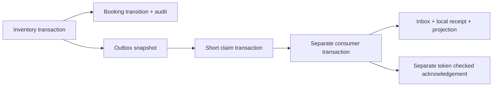

# Scenario 4: preserve delivery work across the commit/publish gap

> **Running this in this repository (note added 2026-10-08).** This tutorial was
> written and verified in the original `D:/java-projects/ticket-booking-lab`. Its
> commands and diagrams keep that lab's addresses as history. In this standalone
> repository, run from `D:/sd-book-my-show` (Compose project `sd-book-my-show`) and
> substitute: API A 8105→**8130**, API B 8106→**8131**, gateway 8107→**8132**,
> provider 8123→**8133** (container port 8121 unchanged), PostgreSQL 5547→**5553**.
> The full mapping is in [standalone setup](STANDALONE_SETUP.md#separate-local-addresses).
> `git diff 6c2e57a..main` shows the generic code it uses is unchanged; later
> commits added only movie code and resource limits.
> Recommended order: see the [study path](PROJECT_STATUS.md#study-path).

Implemented 2026-10-05 after the user continued the completed scenarios 1–3.
This lesson adds a transactional outbox, recoverable dispatcher, local inbox,
notification receipts and a versioned delivery projection. Existing seat/payment
correctness remains authoritative. [Verification](VERIFICATION.md) records what
was actually executed; no real email, broker or payment provider is introduced.

## Five interview points and a spoken answer

1. Store the business transition and its outbox event in the **same transaction**.
   Both commit or both roll back; an in-memory task scheduled after commit is insufficient.
2. Claim delivery work briefly, commit, deliver outside inventory locks, then
   acknowledge with a token/unexpired lease. Another replica can recover abandoned work.
3. Expect duplicate delivery after consumer commit but before dispatcher acknowledgement.
   Commit the inbox deduplication record and local effect together.
4. Use immutable event IDs for duplicates and per-booking versions for ordering.
   An old confirmation must not reactivate a cancelled projection.
5. Observe undelivered count/age and assign a reconciliation owner. Process health
   alone says nothing about delivery progress or the remote side effect.

**A short spoken answer:** “When a booking becomes confirmed, we insert its outbox
snapshot inside that same seat-locked transaction. A dispatcher claims the event
and commits before invoking the local consumer. The consumer commits its inbox
record, notification receipt and projection together. A crash before the dispatcher
acknowledges causes redelivery, so the event ID prevents duplicate local receipts.
Booking versions stop a stale confirmation from overriding cancellation. This
proves recoverable local delivery, not exactly-once email across a network.”

> **Common misconception.** "The outbox gives exactly-once delivery." It gives
> *at-least-once* delivery of work that was committed together with the business
> change. Duplicates are expected. The inbox's unique receipt makes the *local*
> effect happen once, but it cannot make an external email or provider call exactly-once.

## 1. See the two different failure gaps

The original payment reference commits its payment before publishing to Redis.
If the process dies in between, the business state exists but the event does not.
Our earlier booking lab had durable confirmation/audit, without notification work.

```text
Unsafe dual write:
  commit CONFIRMED → process dies → notification was never scheduled

Now, source transaction:
  CONFIRMED + audit + outbox snapshot → one PostgreSQL commit
  process dies → another replica still sees the committed outbox row

Remaining delivery gap:
  consumer commits inbox + receipt → dispatcher dies before ack
  lease expires → redelivery → inbox finds original event → no second receipt
```

The outbox removes the loss window between source commit and scheduling. It does
not turn two separate source/consumer transactions into a distributed transaction.
Duplicate delivery is a normal recovery outcome.

**Interview points — atomic source work:**

- “Business row committed” and “message published” are separate facts.
- Outbox insertion belongs inside the business transaction, before commit.
- Rollback must remove both the state transition and its delivery intent.
- Only a successful confirmation transition emits CONFIRMED; late payment SUCCESS
  on an expired/cancelled booking requires refund and emits no false confirmation.

The additive V4 migration starts existing bookings at deliveryVersion 0. It does
**not** backfill historical confirmations or send retrospective notices. A new
cancellation of an old booking can be its first snapshot, CANCELLED/version1.
That is a deliberate cutover boundary, not evidence that historical delivery exists.

## 2. Read these files in this order

| Order | Source | Question |
| --- | --- | --- |
| 1 | [V4 migration](../src/main/resources/db/migration/V4__transactional_outbox.sql) | Which identities, leases, inbox records and receipts persist? |
| 2 | [PaymentProcessor.apply](../src/main/java/com/example/booking/PaymentProcessor.java) | When does confirmation increment delivery_version and enqueue its event? |
| 3 | [BookingService.cancel](../src/main/java/com/example/booking/BookingService.java) | Why does a repeated cancellation create no second event? |
| 4 | [BookingStore.enqueueSnapshot](../src/main/java/com/example/booking/BookingStore.java) | How does the insert join the existing transaction? |
| 5 | [OutboxDispatcher](../src/main/java/com/example/booking/OutboxDispatcher.java) | Locate claim, consumer invocation, ack, lease recovery and error policy |
| 6 | [LocalNotificationSink](../src/main/java/com/example/booking/LocalNotificationSink.java) | Locate atomic inbox/effect and monotonic projection update |
| 7 | [OutboxWorker](../src/main/java/com/example/booking/OutboxWorker.java) | How do scheduler enablement and lifecycle admission interact? |
| 8 | [diagnostics](../src/main/java/com/example/booking/DeliveryController.java) / [controls](../src/main/java/com/example/booking/OutboxController.java) | Which routes remain available when fault controls are off? |
| 9 | [integration tests](../src/test/java/com/example/booking/OutboxIntegrationTest.java) | Identify real PostgreSQL rollback, race, fencing and reorder assertions |

No previous migration is rewritten. Confirmation and cancellation retain the
seat→booking→payment inventory order. Snapshot sequence increments occur while
the booking is locked; they are **event ordering**, not optimistic seat locking.

## 3. Source transaction and event contract

On successful confirmation, SQL changes state to CONFIRMED and increments
delivery_version. The same transaction inserts the CONFIRMED audit and outbox row.
Cancellation similarly increments the sequence and inserts CANCELLED once, for
an actual transition from HELD/CHECKOUT/CONFIRMED. Repeated cancel simply replays.
Duplicate callbacks find a terminal payment and do not emit another confirmation.

The snapshot contains a stable UUID event ID, booking ID, per-booking version,
kind CONFIRMED/CANCELLED and schemaVersion 1. Payload fields never change through
the API. Delivery metadata (attempts/lease/nextAt/ack) changes separately. There is
a unique booking/version constraint. Knowing an event ID permits a local control
to read its original committed snapshot; controls accept no caller-supplied event
payload, booking association or state override.

enqueueSnapshot refuses to run without an active transaction. It does not open a
second transaction: it uses the same JDBC connection already bound to the caller.
The tests wrap real callback/cancel work in a transaction that subsequently throws,
then establish that source changes and outbox rows disappear together. The separately
committed payment-provider receipt survives, preserving prior uncertainty semantics.



## 4. Dispatcher claims and acknowledgement

The scheduler selects up to 20 undelivered due events, ordered nextAt/UUID. Selection
does not grant ownership. Each conditional UPDATE creates a random token, sets a 5s
lease and increments attempts only if no active lease or delivered marker exists.
This short transaction commits before consumer processing. Both API replicas can
select the same event, but only an eligible claim proceeds.

After consumer commit, a separate ack marks delivered_at only with the current
token and an unexpired lease. An old owner can neither acknowledge a newer owner's
lease nor acknowledge after expiry. Its consumer delivery may already have occurred:
inbox deduplication and event versions protect that separate boundary.

If DB operations fail, the batch aborts without manufacturing delivery success.
The committed claim remains until lease expiry. Other caught RuntimeExceptions
defer that item 2s, clear its active lease only when token/time still match, and
continue later events. This outbox has **no automatic attempt-count exhaustion or
quarantine policy**; its retained retry process continues while enabled. Scenario 3's
three-failure quarantine applies to payments, not implicitly to this new table.
A permanently failing delivery needs operator investigation or a separately
designed outbox dead-letter policy. One DB attempt is bounded by the existing
lock/statement/transaction timeouts; overall delivery time is not bounded by an SLO.

**Interview points — recoverable delivery:**

- Claims must commit before delivery; do not hold inventory locks across delivery.
- Lease expiry lets another replica reclaim abandoned work.
- Ack requires the current token and unexpired lease, not just an event ID.
- Consumer commit can precede ack; redelivery is required for recovery.
- Durable retry scheduling and overall retry/retention policy are separate choices.

OutboxWorker runs every 500ms after the previous tick, with a 1500ms initial delay.
It is enabled only when both maintenance and outbox-dispatch flags are true. The
AdmissionGate prevents new scheduled ticks during drain; accepted work can finish.
Spring's default scheduler still shares a thread between scheduled methods here,
so these components do not establish CPU/thread isolation or independent throughput.

## 5. Atomic inbox, local effect and ordering

The consumer resolves the original outbox snapshot and begins a separate short
transaction. It creates/locks the booking's projection row, serializing deliveries
for that booking. Existing inbox event ID means replay: increment delivery count
without creating another receipt or changing projection. For a new event, insert
its inbox record, and only if its version exceeds projection version update the
projection and insert one local notification receipt in the **same transaction**.

An exception before consumer commit rolls back all three. A failed consumer cannot
leave an inbox “processed” marker without its local effect. The tests establish this
with actual PostgreSQL rollback and 16 concurrent same-ID consume calls: one original
effect, one receipt and sixteen observed deliveries.

| Delivery order | Projection outcome | Local receipt outcome |
| --- | --- | --- |
| CONFIRMED 1 → CANCELLED 2 | CONFIRMED then CANCELLED 2 | One receipt for each advancing snapshot |
| CANCELLED 2 → CONFIRMED 1 | Remains CANCELLED 2 | Cancellation receipt only; stale confirmation ignored |
| Same event twice | Unchanged after first application | One receipt, increased inbox delivery count |

Versions are for **complete state snapshots**. Skipping old snapshots is suitable
for this tiny projection; it would be unsafe for money-transfer deltas or additive
inventory changes. Versions can have gaps in consumer arrival order. This does
not prove FIFO transport, causal delivery to external clients or ordered emails.
Before cancellation itself arrives, the consumer can temporarily show an older
confirmation. The monotonic rule prevents reactivation **after it has seen the
newer cancellation**. There is no strong cross-service read-after-cancel guarantee.

**Interview points — deduplication and ordering:**

- Inbox event identity handles duplicates; booking version handles reordering.
- Commit the dedup marker and effect together; either alone leaves another gap.
- A snapshot can supersede older snapshots; deltas require different ordering rules.
- Local unique receipts do not prove exactly-once external notification delivery.

The consumer and source share one PostgreSQL failure domain, but their transaction
commits are separate. This models delivery/ack gaps without adding a broker/network
service. A real mail provider would need its own durable send identity, acceptance
receipt and uncertain-response reconciliation; that mechanism is not implemented.

## 6. Run the two actual crash experiments

```powershell
Set-Location D:/java-projects/ticket-booking-lab
mvn -B -ntp verify
docker compose -f compose.yml -f compose.failover.yml -f compose.outbox.yml config --quiet
docker compose -f compose.yml -f compose.failover.yml -f compose.outbox.yml build api-a api-b
docker compose -f compose.yml -f compose.failover.yml -f compose.outbox.yml up -d --wait
node scripts/learn-outbox.mjs
npx --yes newman@6.2.2 run postman/outbox.postman_collection.json -e postman/outbox.postman_environment.json
```

The overlay turns both maintenance loops and automatic dispatch off, enabling
explicit controls. Use the default simulator; the historical independent provider's
8123 conflicts with running URL-shortener C and is not needed. Run scripts and
collections sequentially with fresh retained fixtures. No deletion/reset occurs.

The runtime harness first confirms through A without dispatch, SIGKILLs A, and
delivers the persisted event through B. It restarts A, then delays a second dispatch
by 10000ms **after consumer commit**. waitingEvents plus B's delivery diagnostics
establish that receipt/inbox exist while outbox ack is absent. SIGKILL loses that
HTTP response. B rejects dispatch while the lease is live, then reclaims after
expiry and sees the same inbox event. Attempts 2/deliveries 2/receipts 1 demonstrate
redelivery without duplicate local effect. It also races A/B claims and delivers
cancellation before confirmation. Its finally restores A/B/gateway; evidence goes
to target/outbox-runtime-evidence.json. Check restoration if execution fails.

Default operation uses no delay, regardless of retained fixture flags. Optional
delay controls are bounded 0..10000ms and absent when OUTBOX_CONTROLS_ENABLED=false.
The shared gateway returns 404 for replica-specific outbox controls; use direct A/B.
Diagnostic GETs remain accessible through the gateway.

Restore normal scheduled operation after study:

```powershell
docker compose -f compose.yml -f compose.failover.yml up -d --wait
```

Stop without deleting retained data:

```powershell
docker compose -f compose.yml -f compose.failover.yml stop
```

## 7. Postman and IntelliJ walkthrough

Import [collection](../postman/outbox.postman_collection.json) and
[environment](../postman/outbox.postman_environment.json). First booking confirms
with one pending event and no receipt. B dispatches it; repeat dispatch skips it,
and explicit duplicate consume increments inbox deliveries without another receipt.
The second booking confirms then cancels. Consume CANCELLED 2 first, CONFIRMED 1 next:
expect STALE_IGNORED, projection CANCELLED 2 and one cancellation receipt. Tick acks
both original events without reversing projection. Invalid/missing delay and unknown
event fail without changing source ownership.

Useful calls:

```http
GET /api/bookings/{bookingId}/delivery
GET /api/outbox/status
GET /api/demo/outbox/controls
POST /api/demo/outbox/tick
POST /api/demo/outbox/events/{eventId}/dispatch
POST /api/demo/outbox/events/{eventId}/consume

POST /api/demo/outbox/events/{eventId}/delay
Content-Type: application/json

{"delayMs":10000}
```

Set breakpoints at enqueueSnapshot, after the dispatcher claim transaction returns,
inside consumer transaction before receipt insert, after consume returns, and at ack.
Use another DB connection to inspect committed work at each boundary. A debugger
pause longer than 5s makes the token's lease stale; acknowledgement must fail. Never
extend/remove fences merely to make an experiment pass. Inspect bookingVersion,
inbox disposition, delivery count and receipt identity when reordering.

## 8. Capacity, ownership, migration and failure domains

If one local consume+ack costs c seconds, a sequential worker's ideal completion
bound is 1/c. A20-event batch plus 500ms fixed-delay has ideal rate 20/(20c+0.5), below
which actual throughput falls with SQL contention/other scheduler work. Two APIs
can overlap selections and share PostgreSQL, so doubling replicas does not prove
double delivery capacity. Measure arrival rate, drain rate and oldest pending age.
These equations are assumptions for sizing, not measured throughput here.

One booking's projection row serializes its events; unrelated bookings have different
projection locks. Large backlogs require indexed candidates and operational limits.
Future scaling options include partitioning by booking ID, dedicated dispatcher
workers, CDC/broker transport and independently stored consumer inbox. A partitioning
change must preserve event identity and per-booking ordering semantics. No such
infrastructure or replay migration is silently added to this lab.

Operations owns pending-event investigation: distinguish source commit, consumer
receipt and source ack; inspect event/attempt/lease/age; restore a failed dependency
or worker; retry the same event identity; verify projection and refund obligations.
Alert candidates: oldest pending age, count growth, repeated lastError signatures
and sustained attempts without acknowledgement. Health endpoints/diagnostics do
not implement an alerting platform or promise a recovery SLO.

Rollout V4 before upgraded writers. Old writers ignore outbox insertion, so mixed
old/new source replicas can create confirmations without delivery work even though
the schema is compatible. Drain/stop old source writers, upgrade them, then enable
delivery consumers. Existing pre-V4 history is intentionally unbackfilled. Any
later backfill requires an explicit delivery horizon, identity/dedup scheme and
policy for already cancelled bookings; blanket “send all past confirmations” is unsafe.
Retain source events/inbox/receipts throughout this study. Production retention
needs a replay/idempotency window and archival policy; no cleanup authority is implied.

**Interview points — operations and rollout:**

- Track the age of durable work, not just worker liveness.
- Source and consumer transactions are separate even if they share storage.
- Schema compatibility does not make old writers emit new events.
- Define replay/retention and ownership before introducing bulk backfill or pruning.

One local DB/host remains the failure domain for inventory, outbox, inbox and
receipts. No database HA, real sends, production authentication, external exactly-once,
strict fairness or sustained-load/SLO claim follows from the finite experiments.

## 9. Sources and exercises

Local reference first: [original JavaScript payment processor](D:/AA-SYSTEM-DESIGN-ARCHITECTURE/sep-30-2026/sdir-p-main/Designing_for_Global_Payment_Systems/global-payment-system/services/processor/server.js)
performs COMMIT before Redis metrics/publish. That illustrates the dual-write gap;
its contract is not ported or executed. No dedicated original outbox demo was found
in the canonical case index/tree or the downloaded article manifest. Related local
[failure article](D:/AA-SYSTEM-DESIGN-ARCHITECTURE/SDIR-pdf/systemdr-roadmap-sources/024-designing-for-failure-mastering-timeouts.html)
supplies failure/retry background. The primary design reference is
[AWS transactional outbox guidance](https://docs.aws.amazon.com/prescriptive-guidance/latest/cloud-design-patterns/transactional-outbox.html),
which discusses atomic source intent, rollback and duplicate-consuming concerns.
This implementation keeps delivered records instead of deleting outbox rows.

Exercises:

1. List the three commits for one dispatch. Kill the worker between each pair;
   predict what B can discover and which identity it must retain.
2. Explain why an inbox insert outside the receipt transaction would be unsafe.
   Reproduce the consumer rollback/concurrency test in IntelliJ.
3. Deliver cancellation before confirmation. Explain why event ID alone cannot
   stop reactivation and why sequence comparison is safe for snapshots, not deltas.
4. Explain why source deliveredAt can be null when the local receipt already exists.
   Define what an operator should inspect before creating any new logical event.
5. Design an upgrade order and explicit backfill boundary for historical bookings.
   Identify which guarantees fail if an old writer remains in the fleet.

Stop after scenario 4. Durable refund compensation, database HA, optimistic seat
versions and a general retry-storm harness remain separate proposals.
